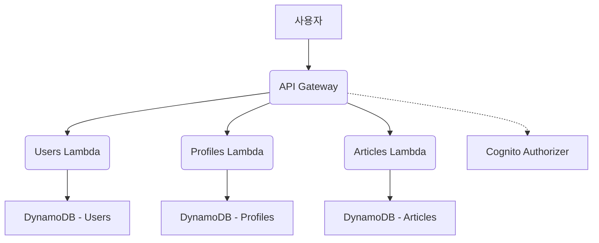

# 아키텍처 설계

기존 애플리케이션은 모듈러 모놀리식 구조로 동작하며 Keycloak과 PostgreSQL을 사용합니다. 마이크로서비스 전환 후에는 AWS의 완전관리형 서비스를 활용해 다음과 같이 구성합니다.

## 주요 컴포넌트

- **API Gateway** – 모든 클라이언트 요청 진입점이며 Cognito JWT를 검증합니다.
- **AWS Lambda** – 각 서비스(users, profiles, articles)를 독립 함수로 배포합니다.
- **Amazon DynamoDB** – 서비스별 테이블을 사용해 데이터 스토어를 분리합니다.
- **Amazon Cognito** – 사용자 인증 및 권한 관리 역할을 수행합니다.
- **CloudWatch/X-Ray** – 로깅과 모니터링, 추적을 담당합니다.

서비스 간 필요 시 SNS/SQS 또는 EventBridge를 통해 비동기 통신을 구현할 수 있습니다.

