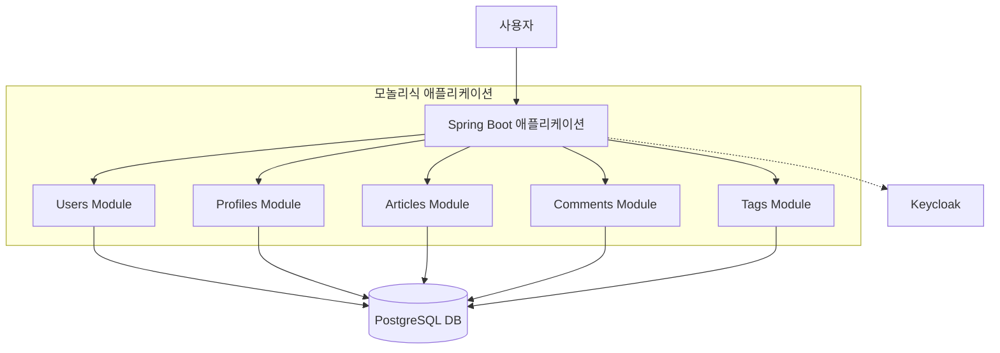
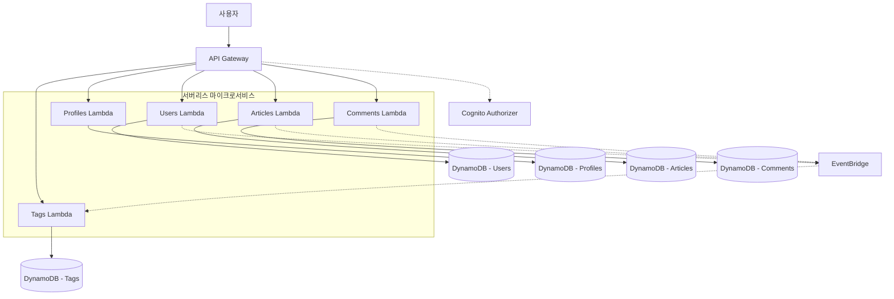
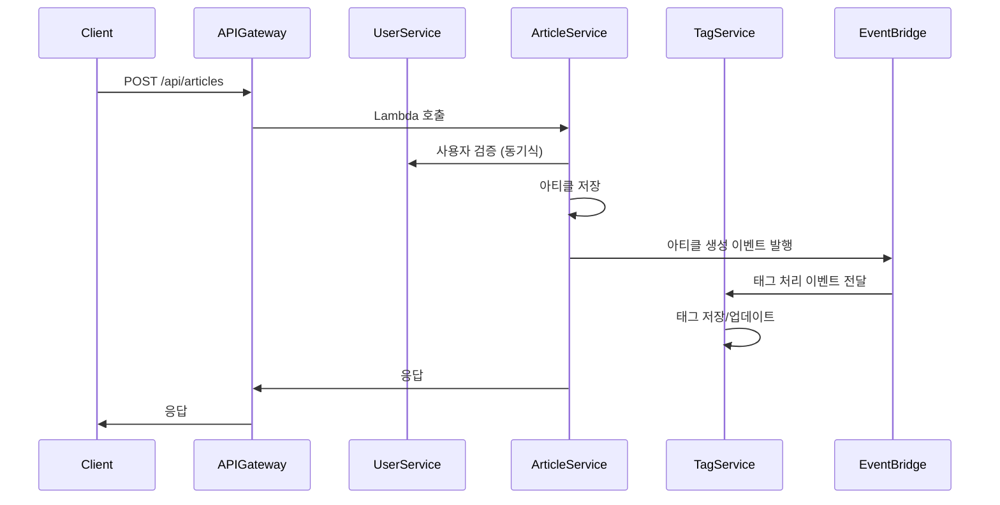
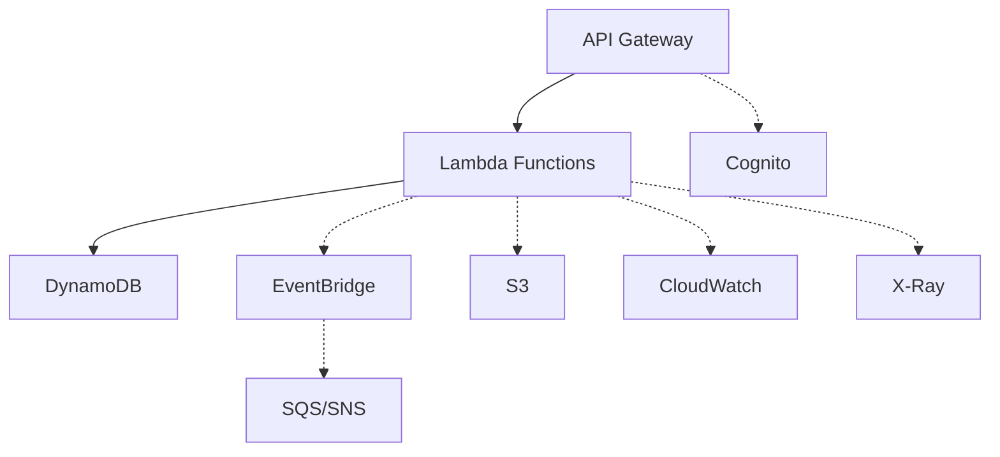
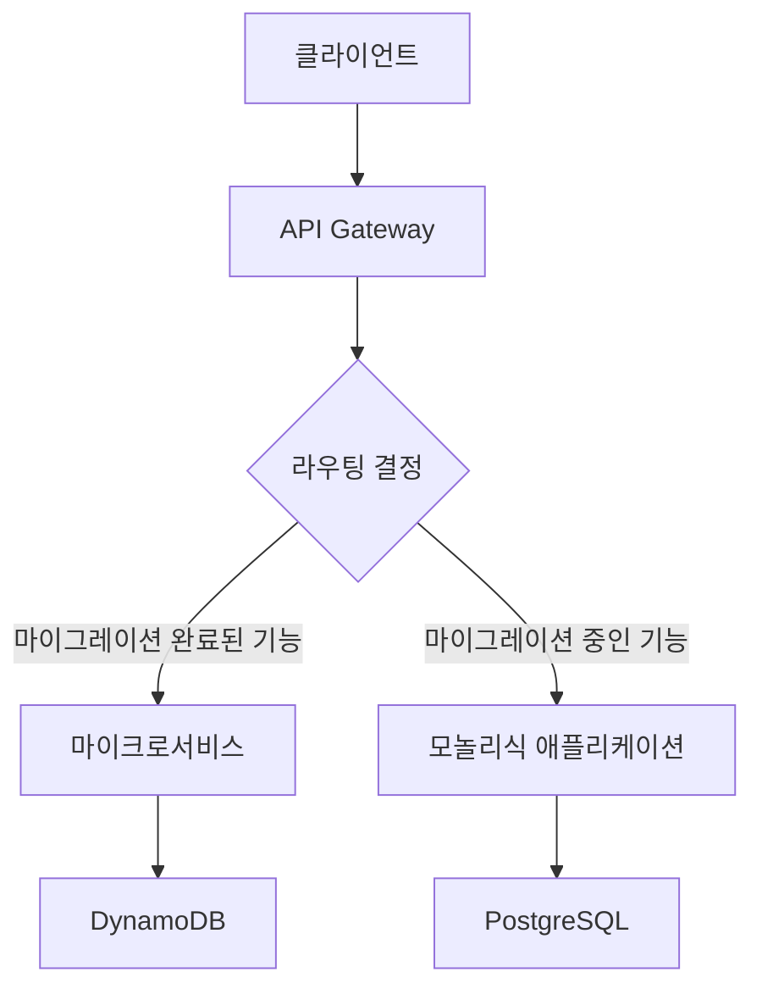

# RealWorld 서버리스 마이크로서비스 아키텍처 설계 및 마이그레이션 계획

## 1. 개요

이 문서는 RealWorld 애플리케이션의 백엔드를 모놀리식 아키텍처에서 서버리스 마이크로서비스 아키텍처로 마이그레이션하기 위한 설계 계획을 설명합니다. 이 설계는 AWS 서버리스 서비스를 활용하여 확장성, 유지보수성, 비용 효율성을 향상시키는 것을 목표로 합니다.

## 2. 마이그레이션 전후 아키텍처 비교

### 2.1. 마이그레이션 전 아키텍처 (모듈러 모놀리식)

기존 애플리케이션은 모듈러 모놀리식 구조로 동작하며 Keycloak과 PostgreSQL을 사용합니다.



### 2.2. 마이그레이션 후 아키텍처 (서버리스 마이크로서비스)

마이크로서비스 전환 후에는 AWS의 완전관리형 서비스를 활용해 다음과 같이 구성합니다.



## 3. 주요 컴포넌트

- **API Gateway** – 모든 클라이언트 요청 진입점이며 Cognito JWT를 검증합니다.
- **AWS Lambda** – 각 서비스(users, profiles, articles, comments, tags)를 독립 함수로 배포합니다.
- **Amazon DynamoDB** – 서비스별 테이블을 사용해 데이터 스토어를 분리합니다.
- **Amazon Cognito** – 사용자 인증 및 권한 관리 역할을 수행합니다.
- **EventBridge** – 서비스 간 이벤트 기반 통신을 지원합니다.
- **SQS/SNS** – 비동기 메시지 처리를 담당합니다.
- **CloudWatch/X-Ray** – 로깅과 모니터링, 추적을 담당합니다.

## 4. 서비스 경계 정의

기존 코드베이스 분석을 통해 다음과 같은 마이크로서비스로 분리합니다:

### 4.1. 사용자 서비스 (User Service)

**책임:**
- 사용자 등록 및 인증
- 사용자 정보 관리 (조회, 수정)
- JWT 토큰 발급 및 검증

**주요 엔티티:**
- User

**API 엔드포인트:**
- POST /api/users (사용자 등록)
- POST /api/users/login (로그인)
- GET /api/user (현재 사용자 조회)
- PUT /api/user (사용자 정보 수정)

### 4.2. 프로필 서비스 (Profile Service)

**책임:**
- 사용자 프로필 관리
- 팔로우/언팔로우 기능

**주요 엔티티:**
- Profile
- Follow

**API 엔드포인트:**
- GET /api/profiles/:username (프로필 조회)
- POST /api/profiles/:username/follow (팔로우)
- DELETE /api/profiles/:username/follow (언팔로우)

### 4.3. 아티클 서비스 (Article Service)

**책임:**
- 아티클 생성, 조회, 수정, 삭제
- 아티클 검색 및 필터링
- 아티클 즐겨찾기 기능

**주요 엔티티:**
- Article
- Favorite

**API 엔드포인트:**
- GET /api/articles (아티클 목록 조회)
- GET /api/articles/feed (피드 조회)
- GET /api/articles/:slug (아티클 상세 조회)
- POST /api/articles (아티클 생성)
- PUT /api/articles/:slug (아티클 수정)
- DELETE /api/articles/:slug (아티클 삭제)
- POST /api/articles/:slug/favorite (즐겨찾기 추가)
- DELETE /api/articles/:slug/favorite (즐겨찾기 삭제)

### 4.4. 댓글 서비스 (Comment Service)

**책임:**
- 아티클에 대한 댓글 생성, 조회, 삭제

**주요 엔티티:**
- Comment

**API 엔드포인트:**
- GET /api/articles/:slug/comments (댓글 목록 조회)
- POST /api/articles/:slug/comments (댓글 생성)
- DELETE /api/articles/:slug/comments/:id (댓글 삭제)

### 4.5. 태그 서비스 (Tag Service)

**책임:**
- 태그 관리 및 조회

**주요 엔티티:**
- Tag

**API 엔드포인트:**
- GET /api/tags (태그 목록 조회)

## 5. 서비스 간 통신 패턴

### 5.1. 동기식 통신 (Synchronous Communication)

- **API Gateway + Lambda**: 클라이언트 요청을 처리하기 위한 주요 통신 방식
- **AWS AppSync**: GraphQL API를 통한 효율적인 데이터 요청 처리 (선택적)

### 5.2. 비동기식 통신 (Asynchronous Communication)

- **EventBridge**: 서비스 간 이벤트 기반 통신
  - 예: 새 아티클 생성 시 태그 서비스에 알림
- **SQS**: 메시지 큐를 통한 비동기 작업 처리
  - 예: 사용자 등록 후 환영 이메일 발송
- **SNS**: 이벤트 발행-구독 모델
  - 예: 아티클 업데이트 시 관련 서비스에 알림

### 5.3. 서비스 간 통신 예시



## 6. 데이터 모델 설계 (DynamoDB)

### 6.1. 단일 테이블 vs. 다중 테이블 접근 방식

마이크로서비스 아키텍처에서는 각 서비스가 자체 데이터를 소유하는 다중 테이블 접근 방식을 채택합니다. 이는 서비스 간 결합도를 낮추고 독립적인 배포와 확장을 가능하게 합니다.

### 6.2. 사용자 서비스 테이블

```typescript
interface UserItem {
  PK: string;         // USER#<email>
  SK: string;         // METADATA
  username: string;
  email: string;
  bio: string;
  image: string;
  password: string;   // 해시된 비밀번호
  createdAt: string;
  updatedAt: string;
  GSI1PK: string;     // USERNAME#<username>
  GSI1SK: string;     // METADATA
}
```

### 6.3. 프로필 서비스 테이블

```typescript
interface FollowItem {
  PK: string;         // USER#<follower_username>
  SK: string;         // FOLLOWS#<followed_username>
  followerUsername: string;
  followedUsername: string;
  createdAt: string;
  GSI1PK: string;     // USER#<followed_username>
  GSI1SK: string;     // FOLLOWER#<follower_username>
}
```

### 6.4. 아티클 서비스 테이블

```typescript
interface ArticleItem {
  PK: string;         // ARTICLE#<slug>
  SK: string;         // METADATA
  title: string;
  description: string;
  body: string;
  slug: string;
  authorUsername: string;
  createdAt: string;
  updatedAt: string;
  favoritesCount: number;
  tagList: string[];
  GSI1PK: string;     // AUTHOR#<username>
  GSI1SK: string;     // ARTICLE#<createdAt>
}

interface FavoriteItem {
  PK: string;         // ARTICLE#<slug>
  SK: string;         // FAVORITE#<username>
  username: string;
  articleSlug: string;
  createdAt: string;
  GSI1PK: string;     // USER#<username>
  GSI1SK: string;     // FAVORITE#<createdAt>
}
```

### 6.5. 댓글 서비스 테이블

```typescript
interface CommentItem {
  PK: string;         // ARTICLE#<slug>
  SK: string;         // COMMENT#<commentId>
  id: string;
  body: string;
  authorUsername: string;
  articleSlug: string;
  createdAt: string;
  updatedAt: string;
  GSI1PK: string;     // AUTHOR#<username>
  GSI1SK: string;     // COMMENT#<createdAt>
}
```

### 6.6. 태그 서비스 테이블

```typescript
interface TagItem {
  PK: string;         // TAG#<tagName>
  SK: string;         // METADATA
  name: string;
  count: number;
  createdAt: string;
  updatedAt: string;
}

interface ArticleTagItem {
  PK: string;         // TAG#<tagName>
  SK: string;         // ARTICLE#<slug>
  tagName: string;
  articleSlug: string;
  createdAt: string;
  GSI1PK: string;     // ARTICLE#<slug>
  GSI1SK: string;     // TAG#<tagName>
}
```

## 7. 인프라 아키텍처

### 7.1. AWS 서비스 구성



### 7.2. 서비스별 AWS 리소스

| 서비스 | Lambda 함수 | DynamoDB 테이블 | 기타 리소스 |
|-------|------------|----------------|-----------|
| 사용자 서비스 | registerUser, loginUser, getCurrentUser, updateUser | UserTable | Cognito User Pool |
| 프로필 서비스 | getProfile, followUser, unfollowUser | ProfileTable | - |
| 아티클 서비스 | createArticle, getArticles, getArticle, updateArticle, deleteArticle, favoriteArticle, unfavoriteArticle | ArticleTable | S3 (이미지 저장) |
| 댓글 서비스 | createComment, getComments, deleteComment | CommentTable | - |
| 태그 서비스 | getTags | TagTable | - |

## 8. API 계약 (API Contracts)

각 서비스는 TypeScript 인터페이스를 통해 정의된 API 계약을 준수해야 합니다. 이 계약은 `shared-types` 패키지에 정의되어 있으며, 모든 서비스가 일관된 데이터 형식을 사용하도록 보장합니다.

## 9. 오류 처리 및 재시도 전략

### 9.1. 오류 처리

- HTTP 상태 코드와 표준화된 오류 응답 형식 사용
- 각 서비스는 자체 도메인 예외를 정의하고 처리
- 글로벌 오류 핸들러를 통한 일관된 오류 응답 형식

### 9.2. 재시도 전략

- Lambda 함수의 자동 재시도 (최대 2회)
- SQS 데드 레터 큐 (DLQ)를 통한 실패한 메시지 처리
- 지수 백오프 전략을 사용한 재시도 로직
- CloudWatch 경보를 통한 오류 모니터링 및 알림

## 10. 마이그레이션 전략

### 10.1. 단계적 마이그레이션 접근 방식

1. **준비 단계**
   - 공유 타입 정의 (완료)
   - 서비스 경계 정의 및 설계 (현재 단계)
   - 인프라 코드 작성 (IaC)

2. **서비스별 마이그레이션**
   - 태그 서비스 (가장 단순한 서비스부터 시작)
   - 사용자 서비스
   - 프로필 서비스
   - 아티클 서비스
   - 댓글 서비스

3. **통합 및 테스트**
   - 서비스 간 통합 테스트
   - 엔드-투-엔드 테스트
   - 성능 테스트

4. **전환 및 검증**
   - 점진적인 트래픽 전환
   - 모니터링 및 로깅 설정
   - 롤백 계획 수립

### 10.2. 스트랭글러 패턴 (Strangler Pattern)

기존 모놀리식 애플리케이션을 점진적으로 마이그레이션하기 위해 스트랭글러 패턴을 적용합니다:



1. API Gateway를 통해 새로운 마이크로서비스와 기존 모놀리식 애플리케이션 사이에 파사드 생성
2. 새로운 기능은 마이크로서비스로 구현
3. 기존 기능을 점진적으로 마이크로서비스로 이전
4. 모든 기능이 이전되면 기존 모놀리식 애플리케이션 제거

## 11. 모니터링 및 로깅

### 11.1. 모니터링

- CloudWatch 메트릭을 통한 서비스 상태 모니터링
- X-Ray를 통한 분산 추적
- 사용자 정의 대시보드를 통한 핵심 성능 지표 시각화

### 11.2. 로깅

- 구조화된 JSON 로그 형식
- 상관 관계 ID를 통한 요청 추적
- 로그 수준 구분 (DEBUG, INFO, WARN, ERROR)
- CloudWatch Logs Insights를 통한 로그 분석

## 12. 보안 고려사항

- API Gateway에서의 요청 검증
- Cognito를 통한 사용자 인증 및 권한 부여
- IAM 역할 및 정책을 통한 최소 권한 원칙 적용
- 민감한 정보는 AWS Secrets Manager에 저장
- DynamoDB 암호화
- VPC 엔드포인트를 통한 네트워크 격리

## 13. 비용 최적화

- 서버리스 아키텍처를 통한 사용량 기반 비용 모델
- DynamoDB 자동 스케일링
- Lambda 함수 크기 및 메모리 최적화
- CloudWatch 경보를 통한 비용 모니터링
- 개발 환경에서의 리소스 자동 종료

## 14. 결론

이 문서에서 정의한 서버리스 마이크로서비스 아키텍처는 RealWorld 애플리케이션의 확장성, 유지보수성, 비용 효율성을 향상시킬 것입니다. 각 서비스는 명확한 책임과 경계를 가지며, AWS 서버리스 서비스를 활용하여 운영 복잡성을 최소화합니다.

다음 단계는 이 설계를 바탕으로 인프라 코드를 작성하고, 첫 번째 마이크로서비스를 구현하는 것입니다.
