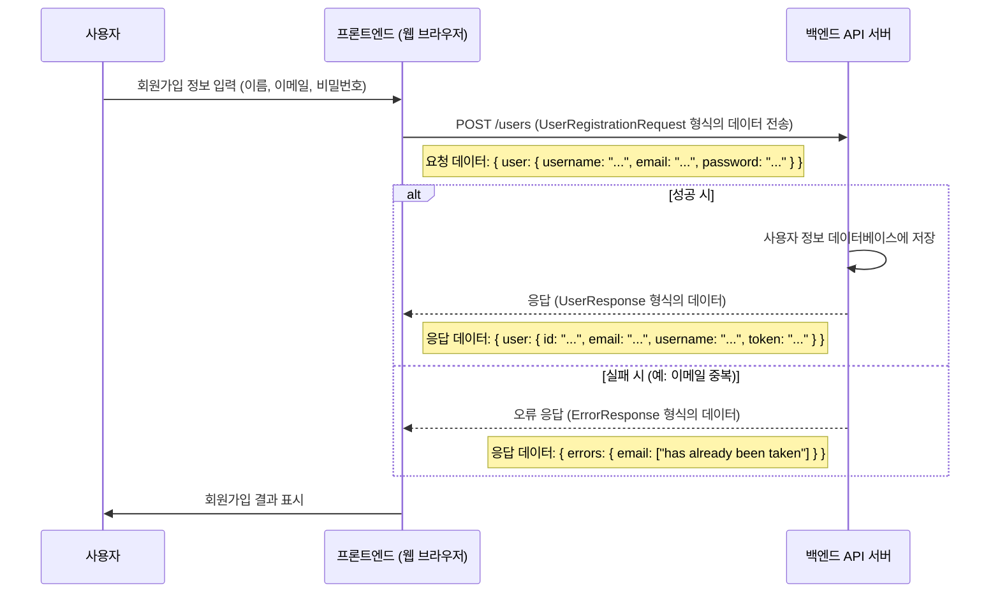

# Chapter 1: 공유 데이터 타입


안녕하세요! `serverless-realworld-monorepo` 프로젝트 튜토리얼에 오신 것을 환영합니다. 이 프로젝트는 실제 서비스와 유사한 블로그 애플리케이션을 서버리스 환경에서 모노레포 구조로 구축하는 과정을 안내합니다.

첫 번째 장에서는 우리 프로젝트의 여러 부분들이 서로 '대화'하는 데 사용하는 아주 중요한 약속, 바로 **공유 데이터 타입**에 대해 알아보겠습니다.

## 왜 공유 데이터 타입이 필요할까요?

애플리케이션을 만들다 보면, 사용자가 보는 화면(프론트엔드)과 실제 데이터를 처리하는 부분(백엔드)이 서로 정보를 주고받아야 합니다. 예를 들어, 사용자가 회원가입을 한다고 생각해 보세요.

1.  **프론트엔드**: 사용자로부터 아이디, 이메일, 비밀번호를 입력받습니다.
2.  **프론트엔드 -> 백엔드**: 이 정보를 백엔드로 전달합니다.
3.  **백엔드**: 전달받은 정보로 사용자 계정을 생성하고, 결과를 프론트엔드로 다시 알려줍니다.

이 과정에서 프론트엔드와 백엔드가 서로 "어떤 모양의 데이터를 주고받을지" 미리 약속하지 않으면 어떻게 될까요? 프론트엔드는 사용자 이름을 `username`으로 보냈는데, 백엔드는 `userID`를 기다리고 있다면? 혹은 프론트엔드는 이메일을 `emailAddress`로 보냈는데, 백엔드는 `mail`로 기대한다면? 마치 서로 다른 언어로 대화하려는 것과 같아서, 당연히 오류가 발생하고 회원가입은 실패할 거예요.

이런 혼란을 막기 위해 **공유 데이터 타입**이라는 '데이터 설계도'를 사용합니다. 이 설계도는 프론트엔드와 백엔드 모두가 "사용자 정보는 이런 항목들(예: `username`, `email`, `password`)로 구성되어야 한다"고 미리 약속하는 것과 같아요. 마치 국제 표준 규격처럼, 모두가 이 설계도를 따르면 데이터가 오고 갈 때 혼동 없이 원활하게 소통할 수 있습니다.

이 프로젝트에서 공유 데이터 타입은 TypeScript의 `interface`를 사용하여 정의됩니다. 이를 통해 개발 과정에서 발생할 수 있는 오류를 미리 줄이고, 코드의 일관성을 유지하며, 마치 통역사 없이도 모두가 이해할 수 있는 공용어를 사용하는 것과 같은 효과를 얻을 수 있습니다.

## `serverless-realworld-monorepo`에서의 공유 데이터 타입

우리 프로젝트에서는 `packages/shared-types`라는 특별한 폴더(패키지)에 모든 공유 데이터 타입을 모아두었습니다. 이렇게 하면 프론트엔드 코드와 백엔드 코드 양쪽에서 동일한 타입 정의를 쉽게 가져다 쓸 수 있습니다.

이 패키지의 핵심은 `src` 폴더 안에 있는 타입 정의 파일들과, 이들을 하나로 모아 내보내는 `src/index.ts` 파일입니다.

```typescript
// 파일: packages/shared-types/src/index.ts

// 모든 엔티티(핵심 데이터) 타입을 내보냅니다.
export * from './entities/user';
export * from './entities/profile';
export * from './entities/article';
export * from './entities/comment';
export * from './entities/tag';

// 모든 API 요청/응답 관련 타입을 내보냅니다.
export * from './api/user';
export * from './api/profile';
export * from './api/article';
export * from './api/comment';
export * from './api/tag';
export * from './api/common';
```

이 `index.ts` 파일을 통해 `shared-types` 패키지는 다양한 데이터 타입을 "수출"합니다. 그러면 프론트엔드나 백엔드에서는 이 패키지를 "수입"해서 약속된 데이터 구조를 사용할 수 있게 됩니다.

공유 데이터 타입은 크게 두 가지 종류로 나눌 수 있습니다:

1.  **엔티티(Entity) 타입**: 애플리케이션의 핵심 데이터 모델을 정의합니다. 예를 들어 사용자(`User`), 게시글(`Article`), 프로필(`Profile`) 등이 여기에 해당합니다.
2.  **API 타입**: 프론트엔드와 백엔드가 API를 통해 통신할 때 주고받는 요청(Request) 및 응답(Response) 데이터의 구조를 정의합니다.

이제 각각을 좀 더 자세히 살펴보겠습니다.

### 1. 엔티티 타입: 데이터의 기본 뼈대

엔티티 타입은 우리 애플리케이션에서 다루는 핵심 데이터들의 구조를 정의합니다. 마치 건물의 설계도처럼, 각 데이터가 어떤 정보를 가져야 하는지를 명시합니다.

**사용자 (User) 엔티티 예시:**

사용자 정보는 어떤 필드들로 구성될까요? `packages/shared-types/src/entities/user.ts` 파일에는 `User` 인터페이스가 이렇게 정의되어 있습니다.

```typescript
// 파일: packages/shared-types/src/entities/user.ts

/**
 * 사용자 엔티티 인터페이스
 * 시스템의 사용자를 나타냅니다.
 */
export interface User {
  id: string;       // 사용자 고유 식별자 (예: "abc-123")
  email: string;    // 이메일 주소 (예: "user@example.com")
  username: string; // 사용자 이름 (예: "johndoe")
  bio?: string;     // 자기소개 (선택 사항, 없을 수도 있음)
  image?: string;   // 프로필 이미지 URL (선택 사항)
  token?: string;   // 인증 토큰 (로그인 시 발급, 선택 사항)
}
```

위 코드를 보면 `User`는 `id`, `email`, `username`을 필수로 가지고, `bio`, `image`, `token`은 선택적으로 가질 수 있다는 것을 알 수 있습니다. `?` 표시는 해당 필드가 있어도 되고 없어도 된다는 의미입니다.

**게시글 (Article) 엔티티 예시:**

블로그 게시글은 어떤 정보를 담고 있을까요? `packages/shared-types/src/entities/article.ts` 파일에서 `Article` 인터페이스를 살펴봅시다.

```typescript
// 파일: packages/shared-types/src/entities/article.ts
import { Profile } from './profile'; // Profile 타입도 공유됩니다!

/**
 * 게시글 엔티티 인터페이스
 * 시스템의 게시글을 나타냅니다.
 */
export interface Article {
  slug: string;             // 게시글 고유 URL 경로 (예: "how-to-train-your-dragon")
  title: string;            // 제목
  description: string;      // 짧은 설명
  body: string;             // 본문 내용
  tagList: string[];        // 태그 목록 (예: ["dragons", "training"])
  createdAt: string;        // 생성된 날짜 및 시간 (ISO 형식 문자열)
  updatedAt: string;        // 마지막으로 수정된 날짜 및 시간
  favorited: boolean;       // 현재 사용자가 '좋아요' 했는지 여부
  favoritesCount: number;   // '좋아요' 총 개수
  author: Profile;          // 작성자 프로필 정보 (Profile 타입 사용)
}
```

`Article` 타입은 제목, 내용뿐만 아니라 태그 목록, 작성자 정보(`Profile` 타입) 등 다양한 정보를 포함합니다. 이렇게 엔티티 타입을 미리 정의해두면, 프론트엔드에서 게시글을 보여줄 때나 백엔드에서 새 게시글을 저장할 때 모두 이 `Article` 구조를 따르게 됩니다.

### 2. API 타입: 프론트엔드와 백엔드의 대화 약속

API 타입은 프론트엔드와 백엔드가 네트워크를 통해 데이터를 주고받을 때 사용하는 "메시지 봉투"와 같습니다. 요청을 보낼 때는 어떤 정보를 봉투에 담아 보내야 하는지, 응답을 받을 때는 봉투 안에 어떤 정보가 들어있을지를 정의합니다.

**사용자 회원가입 API 예시:**

사용자가 회원가입을 시도할 때, 프론트엔드는 백엔드 API로 어떤 정보를 보내야 할까요? 그리고 백엔드는 성공 시 어떤 정보를 응답으로 돌려줄까요? 이는 `packages/shared-types/src/api/user.ts` 파일에 정의되어 있습니다.

```typescript
// 파일: packages/shared-types/src/api/user.ts
import { User } from '../entities/user'; // User 엔티티 타입을 가져옵니다.

/**
 * 사용자 회원가입 요청 시 데이터 구조
 */
export interface UserRegistrationRequest {
  user: {
    username: string;
    email: string;
    password: string;
  };
}

/**
 * 사용자 정보 API 응답 시 데이터 구조
 */
export interface UserResponse {
  user: User; // 위에서 정의한 User 엔티티를 포함합니다.
}
```

-   `UserRegistrationRequest`: 프론트엔드가 회원가입 API를 호출할 때 보내야 하는 데이터의 구조입니다. `user`라는 객체 안에 `username`, `email`, `password`가 있어야 함을 명시합니다.
-   `UserResponse`: 백엔드가 회원가입 성공 또는 사용자 정보 조회 성공 시 프론트엔드로 보내주는 데이터의 구조입니다. 이 안에는 우리가 위에서 살펴본 `User` 엔티티 타입의 정보가 담겨있습니다.

**게시글 생성 API 예시:**

새로운 게시글을 작성할 때 프론트엔드가 백엔드로 보내는 데이터는 어떤 모습일까요? `packages/shared-types/src/api/article.ts`의 `ArticleCreationRequest`를 봅시다.

```typescript
// 파일: packages/shared-types/src/api/article.ts

/**
 * 게시글 생성 요청 시 데이터 구조
 */
export interface ArticleCreationRequest {
  article: {
    title: string;
    description: string;
    body: string;
    tagList?: string[]; // 태그 목록 (선택 사항)
  };
}
```

이처럼 API 요청과 응답에 대한 타입을 명확히 정의함으로써, 프론트엔드 개발자와 백엔드 개발자는 서로 "어떤 데이터를 주고받을지"에 대해 걱정할 필요 없이 각자의 로직 개발에 집중할 수 있습니다.

### 3. 공통 API 타입: 표준화된 응답 처리

애플리케이션을 만들다 보면 여러 API에서 공통적으로 사용되는 응답 구조가 있을 수 있습니다. 예를 들어, API 요청 처리 중 오류가 발생했을 때 일관된 형식으로 오류 메시지를 전달하는 것이 좋습니다. 이를 위해 `packages/shared-types/src/api/common.ts` 파일에 공통 타입을 정의합니다.

**오류 응답 (ErrorResponse) 예시:**

```typescript
// 파일: packages/shared-types/src/api/common.ts

/**
 * 오류 응답 인터페이스
 * API 오류 응답에 사용됩니다.
 */
export interface ErrorResponse {
  errors: {
    // 키는 오류 필드 (예: "email"), 값은 오류 메시지 배열
    [key: string]: string[];
  };
}
```

`ErrorResponse`는 API에서 오류가 발생했을 때 반환되는 데이터의 구조를 정의합니다. `errors` 객체는 어떤 필드에서 어떤 오류가 발생했는지 상세한 정보를 담을 수 있도록 합니다. 예를 들어, 이메일 형식이 잘못되었다면 `{"email": ["is invalid"]}` 와 같은 형태로 오류를 전달할 수 있습니다.

## 공유 데이터 타입, 어떻게 사용될까요? (회원가입 예시)

앞서 언급한 사용자 회원가입 시나리오를 다시 한번 생각해 봅시다. 공유 데이터 타입이 이 과정에서 어떻게 활용되는지 그림으로 표현하면 다음과 같습니다.



1.  **프론트엔드**: 사용자가 입력한 정보를 바탕으로 `UserRegistrationRequest` 타입에 맞는 객체를 만듭니다.
    ```typescript
    // 프론트엔드 코드 (예시)
    const registrationData: UserRegistrationRequest = { // UserRegistrationRequest 타입을 사용!
      user: {
        username: "testuser",
        email: "test@example.com",
        password: "password123"
      }
    };
    // 이 데이터를 백엔드 API로 전송합니다.
    // fetch('/api/users', { method: 'POST', body: JSON.stringify(registrationData), ... });
    ```
    TypeScript를 사용하면, 만약 `username` 필드를 빠뜨리거나 `email`을 `mail`로 잘못 적으면 코드를 실행하기 전(컴파일 시점)에 오류를 발견할 수 있습니다!

2.  **백엔드**: API 엔드포인트는 `UserRegistrationRequest` 타입의 요청을 기다립니다.
    ```typescript
    // 백엔드 API 컨트롤러 코드 (예시 - [백엔드 API 엔드포인트 (컨트롤러)](04_백엔드_api_엔드포인트__컨트롤러__.md) 에서 자세히 다룹니다)
    async function handleRegistration(requestData: UserRegistrationRequest): Promise<UserResponse | ErrorResponse> {
      // requestData는 UserRegistrationRequest 타입임이 보장됩니다.
      const { username, email, password } = requestData.user;

      // ... 사용자 생성 로직 ([백엔드 핵심 서비스 로직](05_백엔드_핵심_서비스_로직_.md) 참고) ...

      if (/* 성공 */ true) {
        const newUser: User = { /* ... 생성된 사용자 정보 ... */ id: "1", email, username, token: "jwt.token.here" };
        return { user: newUser }; // UserResponse 타입으로 응답
      } else {
        // return { errors: { email: ["already taken"] } }; // ErrorResponse 타입으로 응답
      }
    }
    ```
    백엔드에서도 TypeScript 덕분에 `requestData.user.username` 같은 필드에 안전하게 접근할 수 있습니다.

3.  **응답**: 백엔드는 성공 시 `UserResponse` 타입, 실패 시 `ErrorResponse` 타입으로 응답합니다. 프론트엔드는 이 약속된 타입에 맞춰 응답을 처리합니다.

만약 프론트엔드나 백엔드 어느 한쪽이라도 이 약속된 데이터 타입을 따르지 않는다면, 데이터 전송/수신 과정에서 문제가 발생할 것입니다. 하지만 공유 데이터 타입을 사용함으로써 양쪽 모두가 "같은 언어"로 소통하게 되어 이러한 문제를 예방할 수 있습니다.

## 공유 데이터 타입의 내부 동작 (살짝 엿보기)

`packages/shared-types`는 모노레포 내의 독립적인 패키지입니다. 이것이 어떻게 프론트엔드와 백엔드 양쪽에서 사용될 수 있을까요?

1.  **의존성 설정**: 프론트엔드 프로젝트(예: `packages/frontend`)와 백엔드 프로젝트(예: `packages/backend`)의 `package.json` 파일에 `shared-types` 패키지가 의존성으로 추가됩니다.
    ```json
    // 예시: packages/frontend/package.json
    {
      "name": "frontend",
      "dependencies": {
        "@serverless-realworld-monorepo/shared-types": "workspace:*"
        // ... 기타 의존성
      }
    }
    ```
    `"workspace:*"`는 모노레포 관리 도구(예: pnpm, Lerna, Nx)에게 이 패키지가 현재 작업 공간(모노레포) 내에 있다는 것을 알려줍니다.

2.  **임포트(Import)**: 프론트엔드나 백엔드 코드에서는 일반적인 라이브러리를 사용하듯이 `shared-types`에서 정의한 타입을 가져와 사용할 수 있습니다.
    ```typescript
    import { User, ArticleCreationRequest } from '@serverless-realworld-monorepo/shared-types';

    // 이제 User 타입을 변수 타입으로 사용하거나,
    let currentUser: User;

    // ArticleCreationRequest를 함수 인자 타입으로 사용할 수 있습니다.
    // function createArticle(data: ArticleCreationRequest) { /* ... */ }
    ```

3.  **빌드 과정**: `shared-types` 패키지가 빌드되면 `dist` 폴더에 JavaScript 파일과 함께 `.d.ts` 라는 타입 정의 파일이 생성됩니다. (예: `dist/index.d.ts`)
    ```typescript
    // 파일: packages/shared-types/dist/index.d.ts (빌드 후 생성되는 파일의 일부)
    export * from './entities/user';
    export * from './entities/profile';
    // ... 생략 ...
    export * from './api/common';
    //# sourceMappingURL=index.d.ts.map
    ```
    이 `.d.ts` 파일은 JavaScript 코드에는 포함되지 않지만, TypeScript 컴파일러에게 "이 패키지에는 이런 타입들이 있다"고 알려주는 역할을 합니다. 덕분에 다른 패키지에서 `shared-types`를 임포트했을 때 타입 검사와 자동 완성이 가능해집니다.

결국, `shared-types` 패키지는 프론트엔드와 백엔드 모두가 참조하는 "공통의 타입 사전" 역할을 하는 것입니다. 만약 사용자 데이터에 새로운 필드(예: `phoneNumber`)를 추가해야 한다면, `packages/shared-types/src/entities/user.ts` 파일의 `User` 인터페이스만 수정하면 됩니다. 그러면 TypeScript 컴파일러가 이 `User` 타입을 사용하는 프론트엔드와 백엔드의 모든 코드에서 변경 사항을 감지하고, 필요한 수정을 하도록 알려줄 것입니다. 이것이 바로 타입 시스템의 강력한 장점 중 하나입니다!

## 정리하며

이번 장에서는 `serverless-realworld-monorepo` 프로젝트의 기본적이면서도 매우 중요한 개념인 **공유 데이터 타입**에 대해 알아보았습니다. 공유 데이터 타입은 다음과 같은 이점을 제공합니다:

-   **일관성**: 프론트엔드와 백엔드가 동일한 데이터 구조 "설계도"를 공유합니다.
-   **오류 감소**: 개발 단계에서 데이터 불일치로 인한 버그를 TypeScript 컴파일러가 미리 잡아줍니다.
-   **명확한 의사소통**: 개발자 간의 "계약" 역할을 하여, 데이터 구조에 대한 오해를 줄입니다.
-   **유지보수 용이성**: 데이터 구조 변경 시 한 곳(`shared-types`)만 수정하면 관련된 모든 부분에 영향을 미치므로(타입 에러로 알려줌) 관리가 수월해집니다.

공유 데이터 타입은 우리 애플리케이션의 프론트엔드와 백엔드가 서로 원활하게 "대화"할 수 있도록 하는 기반입니다. 이 "공용어" 덕분에 각 부분은 자신이 주고받을 데이터의 형태를 정확히 알고 개발에 집중할 수 있습니다.

다음 장에서는 이 공유 데이터 타입을 바탕으로, 사용자가 프론트엔드에서 어떤 행동들을 하고(예: 로그인, 글쓰기 버튼 클릭), 그에 따라 프론트엔드의 상태(예: 로그인 여부)가 어떻게 관리되는지를 살펴보겠습니다.

➡️ [제2장: 프론트엔드 사용자 액션 및 세션 관리](02_프론트엔드_사용자_액션_및_세션_관리_.md)

---

Generated by [AI Codebase Knowledge Builder](https://github.com/The-Pocket/Tutorial-Codebase-Knowledge)