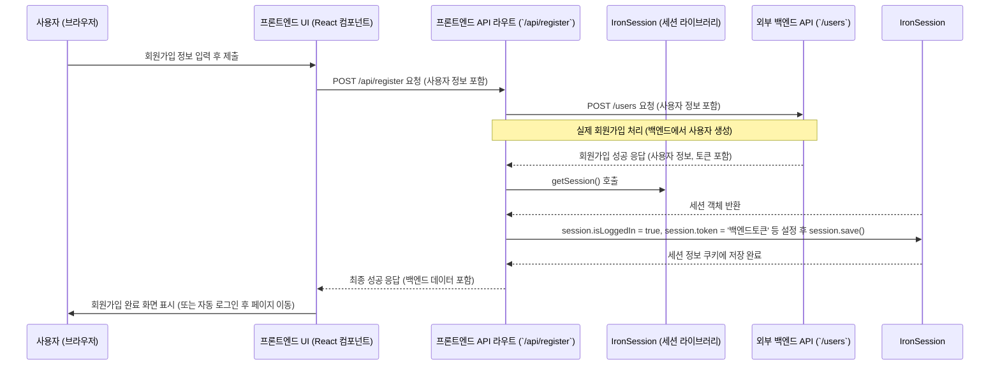

# Chapter 3: 프론트엔드 API 라우트


안녕하세요! 지난 [제2장: 프론트엔드 사용자 액션 및 세션 관리](02_프론트엔드_사용자_액션_및_세션_관리_.md)에서는 사용자의 행동을 감지하고 그들의 로그인 상태를 기억하는 방법에 대해 알아보았습니다. 사용자가 버튼을 누르거나 정보를 제출하면(사용자 액션), 우리 프론트엔드는 이 정보를 바탕으로 세션을 관리하고 때로는 실제 데이터를 변경하기 위해 어딘가에 요청을 보내야 합니다.

이번 장에서는 바로 그 "어딘가" 중 하나인 **프론트엔드 API 라우트**에 대해 이야기해 보겠습니다. 이게 뭐냐구요? 마치 우리 프론트엔드 애플리케이션 내부에 만들어진 작은 API 서버들이라고 생각할 수 있습니다.

## 프론트엔드에 API 서버가 왜 필요할까요?

보통 "API 서버"라고 하면 프론트엔드와는 별개로 존재하는 백엔드 시스템을 떠올립니다. 하지만 때로는 프론트엔드 자체에도 간단한 서버 기능이 필요할 때가 있습니다.

예를 들어, 사용자가 회원가입을 하려고 합니다.
1.  사용자는 프론트엔드 화면에서 아이디, 이메일, 비밀번호를 입력하고 "회원가입" 버튼을 누릅니다.
2.  이때, 프론트엔드 화면(React 컴포넌트)이 직접 아주 멀리 있는 진짜 백엔드 서버와 통신할 수도 있지만, 몇 가지 불편한 점이 있을 수 있습니다. (예: 복잡한 요청 준비, 보안 문제 등)
3.  대신, 프론트엔드 화면은 바로 옆집에 있는 "프론트엔드 API 라우트"라는 중간 다리에게 "이 정보로 회원가입 좀 처리해줘!" 라고 요청합니다.
4.  이 프론트엔드 API 라우트는 요청을 받아서, 실제 백엔드 서버와 통신하거나, 혹은 자체적으로 간단한 데이터를 처리한 후 그 결과를 다시 프론트엔드 화면에 전달해 줍니다.

이것은 마치 식당의 웨이터와 같습니다. 손님(프론트엔드 화면)이 주문을 하면, 웨이터(프론트엔드 API 라우트)는 그 주문을 받아서 주방(실제 백엔드 서버)에 전달하고 완성된 음식을 가져다줍니다. 때로는 웨이터가 직접 간단한 음료(예: 물)를 준비해서 바로 제공하기도 하죠.

우리 `serverless-realworld-monorepo` 프로젝트의 프론트엔드(Next.js)는 이런 "웨이터" 역할을 하는 자체 API 라우트들을 가지고 있습니다. 이를 통해 프론트엔드는 필요한 데이터를 효율적으로 주고받고, 복잡한 로직을 분리하여 관리할 수 있습니다.

## 프론트엔드 API 라우트란 무엇인가요?

Next.js와 같은 최신 프론트엔드 프레임워크는 프로젝트 내부에 API 엔드포인트를 만들 수 있는 기능을 제공합니다. `serverless-realworld-monorepo`의 프론트엔드 부분인 `apps/frontend` 폴더를 보면, `src/app/api/` 라는 폴더가 있습니다. 이 폴더 안에 있는 `route.ts` 파일들이 바로 프론트엔드 API 라우트들입니다.

각 `route.ts` 파일은 특정 URL 경로에 대한 요청을 처리하는 함수들을 정의합니다. 예를 들어, `apps/frontend/src/app/api/articles/route.ts` 파일은 `/api/articles` 라는 URL로 오는 요청을 처리합니다.

이 라우트들은 다음과 같은 역할을 합니다:
*   **실제 백엔드 API와의 중계자**: 프론트엔드 컴포넌트의 요청을 받아 실제 백엔드 API로 전달하고, 그 응답을 다시 컴포넌트로 보내줍니다.
*   **데이터 변환**: 백엔드로부터 받은 데이터를 프론트엔드가 사용하기 좋은 형태로 가공합니다.
*   **보안 강화**: 민감한 API 키나 로직을 클라이언트(브라우저)에 직접 노출하지 않고 서버 사이드(프론트엔드 API 라우트가 실행되는 환경)에서 처리합니다.
*   **세션 연동**: [제2장: 프론트엔드 사용자 액션 및 세션 관리](02_프론트엔드_사용자_액션_및_세션_관리_.md)에서 보았듯이, 로그인/회원가입과 같은 API 라우트에서 세션 정보를 생성하고 관리할 수 있습니다.

## 프론트엔드 API 라우트 사용 예시: 새 게시글 작성

사용자가 새 게시글을 작성하고 "발행" 버튼을 누른다고 상상해 봅시다. 이때 프론트엔드 컴포넌트는 `apps/frontend/src/app/api/articles/route.ts`에 정의된 API 라우트로 게시글 데이터를 보낼 수 있습니다.

다음은 `apps/frontend/src/app/api/articles/route.ts` 파일의 일부입니다. `POST` 요청을 처리하여 새 게시글을 생성하는 로직을 담고 있습니다.

```typescript
// 파일: apps/frontend/src/app/api/articles/route.ts (POST 함수 부분)
import { NextRequest, NextResponse } from 'next/server';
import axios from 'axios'; // HTTP 요청을 위한 라이브러리

export async function POST(req: Request) {
  // 1. 요청 헤더에서 인증 토큰 가져오기 (로그인한 사용자 확인)
  const token: string = req.headers.get('authorization') as string;
  try {
    const body = await req.json(); // 2. 프론트엔드 컴포넌트가 보낸 게시글 데이터

    // 3. 필수 데이터 검증 (간단한 예시)
    if (!body.title)
      return new NextResponse('제목은 필수입니다', { status: 400 });
    // ... 다른 필드 검증 ...

    // 4. 실제 백엔드 API로 게시글 생성 요청 보내기
    const res = await axios.post(
      `${process.env.BASE_URL}/articles`, // 실제 백엔드 API 주소
      {
        article: { /* ... 게시글 데이터 ... */ },
      },
      {
        headers: { Authorization: token }, // 인증 토큰 전달
      }
    );

    // 5. 백엔드 응답을 프론트엔드 컴포넌트로 전달
    return NextResponse.json({ data: await res.data, status: res.status });
  } catch (error: any) {
    // ... 오류 처리 ...
    return new NextResponse('서버 오류 발생', { status: 500 });
  }
}
```

이 코드가 하는 일을 단계별로 살펴봅시다:

1.  **인증 토큰 확인**: `req.headers.get('authorization')`을 통해 요청을 보낸 사용자의 인증 토큰을 가져옵니다. 이 토큰은 사용자가 로그인했을 때 발급되며, [제2장: 프론트엔드 사용자 액션 및 세션 관리](02_프론트엔드_사용자_액션_및_세션_관리_.md)에서 세션에 저장했던 바로 그 토큰입니다.
2.  **요청 본문(Body) 읽기**: `await req.json()`을 통해 프론트엔드 컴포넌트가 보낸 게시글 제목, 내용 등의 데이터를 가져옵니다.
3.  **데이터 검증**: 제목(`body.title`)과 같은 필수 데이터가 제대로 왔는지 간단히 확인합니다.
4.  **실제 백엔드 API 호출**: `axios.post`를 사용하여 `process.env.BASE_URL` (우리 실제 백엔드 서버의 주소)로 시작하는 `/articles` API에 게시글 생성 요청을 보냅니다. 이때, 1번에서 얻은 인증 토큰을 `Authorization` 헤더에 담아 보냅니다. 이렇게 해야 백엔드 서버가 "누가" 이 요청을 보냈는지 알 수 있습니다. 이 실제 백엔드 API의 작동 방식은 [제4장: 백엔드 API 엔드포인트 (컨트롤러)](04_백엔드_api_엔드포인트__컨트롤러__.md)에서 자세히 다룹니다.
5.  **응답 반환**: 백엔드 API로부터 받은 응답을 `NextResponse.json()`을 사용하여 다시 프론트엔드 컴포넌트로 전달합니다.

이처럼 프론트엔드 API 라우트는 프론트엔드 컴포넌트와 실제 백엔드 서버 사이에서 "중간다리" 또는 "대리인" 역할을 수행합니다.

### 프론트엔드 컴포넌트에서의 호출 예시

위의 `/api/articles` (POST) 라우트는 프론트엔드 글쓰기 페이지 컴포넌트에서 다음과 같이 호출될 수 있습니다.

```typescript
// 프론트엔드 글쓰기 페이지 컴포넌트 (간략화된 예시)
async function handlePublish(articleData: any) {
  const sessionToken = /* ... 세션에서 가져온 사용자 토큰 ... */;

  const response = await fetch('/api/articles', { // 우리 프론트엔드 API 라우트 호출
    method: 'POST',
    headers: {
      'Content-Type': 'application/json',
      'Authorization': `Token ${sessionToken}`, // 인증 토큰 전달
    },
    body: JSON.stringify(articleData),
  });

  if (response.ok) {
    const result = await response.json();
    console.log('게시글 생성 성공:', result);
    // 성공 처리 로직 (예: 게시글 상세 페이지로 이동)
  } else {
    console.error('게시글 생성 실패');
    // 실패 처리 로직
  }
}
```
여기서 중요한 점은 `fetch` 요청이 `process.env.BASE_URL`이 아닌, 우리 프론트엔드 내부의 `/api/articles`로 향한다는 것입니다. 이 내부 API 라우트가 위에서 설명한 대로 실제 백엔드와 통신하는 것이죠.

## 또 다른 예시: 게시글 목록 가져오기

게시글 목록을 가져오는 `/api/articles` (GET) 라우트도 살펴봅시다. 이 라우트는 필터링 조건(태그, 작성자 등)을 받아 실제 백엔드에 전달하는 역할을 합니다.

```typescript
// 파일: apps/frontend/src/app/api/articles/route.ts (GET 함수 부분)
export async function GET(req: NextRequest) {
  const token: string = req.headers.get('authorization') as string;

  try {
    // 1. URL 쿼리 파라미터에서 필터링 조건 가져오기
    const tag = req.nextUrl.searchParams.get('tag');
    const limit = req.nextUrl.searchParams.get('limit') || '10'; // 기본값 10
    // ... 다른 파라미터들 ...

    // 2. 실제 백엔드 API로 보낼 URL 만들기
    let url: string = `${process.env.BASE_URL}/articles/?limit=${limit}`;
    if (tag) url += `&tag=${tag}`;
    // ... 다른 파라미터들 추가 ...

    // 3. 실제 백엔드 API로 게시글 목록 요청 보내기
    const res = await axios.get(url, {
      headers: { Authorization: token }, // 인증 토큰 전달 (필요한 경우)
    });

    return NextResponse.json({ data: await res.data, status: res.status });
  } catch (error: any) {
    // ... 오류 처리 ...
    return new NextResponse('서버 오류 발생', { status: 500 });
  }
}
```

1.  **쿼리 파라미터 읽기**: `/api/articles?limit=5&tag=nextjs` 와 같이 URL에 포함된 파라미터들을 읽습니다.
2.  **백엔드 URL 조립**: 읽어들인 파라미터들을 사용하여 실제 백엔드 API에 요청할 전체 URL을 만듭니다.
3.  **백엔드 API 호출**: 조립된 URL로 `axios.get` 요청을 보냅니다. 이때도 인증 토큰을 전달하여, 사용자가 로그인한 상태라면 그에 맞는 데이터(예: '좋아요' 여부)를 받을 수 있도록 합니다.

## 프론트엔드 API 라우트의 내부 흐름 (사용자 회원가입 예시)

사용자가 회원가입을 하는 시나리오를 통해 프론트엔드 API 라우트가 어떻게 동작하는지 순서도로 살펴봅시다. 프론트엔드의 `/api/register` 라우트가 사용됩니다.



1.  사용자가 브라우저에서 회원가입 정보를 입력하고 제출합니다.
2.  프론트엔드 UI (React 컴포넌트)는 이 정보를 가지고 `/api/register` 라는 우리 프론트엔드 내부 API 라우트로 POST 요청을 보냅니다.
3.  `/api/register` 라우트 핸들러 (`apps/frontend/src/app/api/(auth)/register/route.ts`의 `POST` 함수)는 이 요청을 받습니다.
4.  핸들러는 받은 사용자 정보를 실제 백엔드 API의 `/users` 엔드포인트로 다시 POST 요청을 보내 회원가입을 시도합니다.
5.  실제 백엔드 API는 사용자 계정을 생성하고, 성공하면 사용자 정보와 **인증 토큰**을 응답으로 돌려줍니다.
6.  `/api/register` 핸들러는 이 응답을 받고, [제2장: 프론트엔드 사용자 액션 및 세션 관리](02_프론트엔드_사용자_액션_및_세션_관리_.md)에서 배운 `getSession()`을 호출하여 세션 객체를 가져옵니다.
7.  백엔드로부터 받은 사용자 정보와 토큰을 세션 객체에 저장 (`session.isLoggedIn = true`, `session.token = ...`)하고 `session.save()`를 호출하여 이 정보를 암호화된 쿠키에 저장합니다.
8.  마지막으로, `/api/register` 핸들러는 프론트엔드 UI (React 컴포넌트)로 최종 성공 응답을 보냅니다.
9.  프론트엔드 UI는 이 응답을 받고 사용자에게 회원가입이 완료되었음을 알리거나 다음 페이지로 안내합니다.

## 어떤 파일들을 살펴보면 될까요?

우리 프로젝트에서 프론트엔드 API 라우트의 예시를 보려면 다음 파일들을 확인해 보세요:
*   `apps/frontend/src/app/api/` 폴더 전체: 이 안에 있는 모든 `route.ts` 파일들이 각각의 API 엔드포인트를 정의합니다.
    *   `articles/route.ts`: 게시글 목록 조회(GET), 새 게시글 작성(POST)
    *   `articles/[slug]/route.ts`: 특정 게시글 조회(GET), 수정(PUT)
    *   `articles/[slug]/comments/route.ts`: 특정 게시글의 댓글 조회(GET), 새 댓글 작성(POST)
    *   `tags/route.ts`: 태그 목록 조회(GET)
    *   `user/route.ts`: 현재 로그인한 사용자 정보 조회(GET), 사용자 정보 수정(PUT)
    *   `(auth)/login/route.ts`: 로그인 처리(POST), 세션 생성
    *   `(auth)/register/route.ts`: 회원가입 처리(POST), 세션 생성
    *   `profiles/[username]/route.ts`: 특정 사용자 프로필 조회(GET)

각 파일은 특정 HTTP 메서드(GET, POST, PUT, DELETE 등)에 해당하는 함수를 `export` 하는 방식으로 라우트를 정의합니다.

## 프론트엔드 API 라우트 vs. 서버 액션

[제2장: 프론트엔드 사용자 액션 및 세션 관리](02_프론트엔드_사용자_액션_및_세션_관리_.md)에서는 "서버 액션"이라는 것도 배웠습니다. 둘 다 프론트엔드에서 시작되어 서버 쪽에서 실행되는 로직인데, 어떤 차이가 있을까요?

*   **서버 액션 (`actions.ts`)**: 주로 React 컴포넌트 내에서 직접 호출되어 폼 제출이나 데이터 변경(mutation) 같은 작업을 처리하는 데 특화되어 있습니다. 마치 함수 호출처럼 사용하기 편리합니다. 우리 프로젝트에서는 팔로우/언팔로우, 좋아요 등의 액션에 사용됩니다.
*   **프론트엔드 API 라우트 (`app/api/.../route.ts`)**: 좀 더 전통적인 REST API 엔드포인트와 유사합니다. `fetch`나 `axios` 같은 HTTP 클라이언트를 통해 호출됩니다. 데이터를 가져오거나(GET), 복잡한 요청/응답 구조가 필요할 때, 또는 외부 서비스와의 연동 지점이 필요할 때 유용합니다. 우리 프로젝트에서는 로그인, 회원가입, 게시글/댓글 CRUD, 프로필/태그 조회 등에 사용됩니다.

상황에 따라 더 적합한 방식을 선택할 수 있습니다. 두 가지 모두 프론트엔드와 백엔드 사이의 "중간다리" 역할을 수행하며, 실제 로직은 최종적으로 [제4장: 백엔드 API 엔드포인트 (컨트롤러)](04_백엔드_api_엔드포인트__컨트롤러__.md)에서 설명할 실제 백엔드 서버에서 처리되는 경우가 많습니다.

## 정리하며

이번 장에서는 프론트엔드 애플리케이션 내부에 존재하는 작은 API 서버들, 즉 **프론트엔드 API 라우트**에 대해 배웠습니다. 이들은 다음과 같은 중요한 역할을 합니다:

*   프론트엔드 컴포넌트와 실제 백엔드 API 서버 사이의 **중계자** 역할을 합니다.
*   요청/응답 데이터를 **가공**하거나 **검증**할 수 있습니다.
*   실제 백엔드 API의 주소나 민감한 정보를 클라이언트로부터 **숨길 수 있습니다**.
*   [제2장: 프론트엔드 사용자 액션 및 세션 관리](02_프론트엔드_사용자_액션_및_세션_관리_.md)에서 본 것처럼 **세션 관리와 긴밀하게 연동**되어 사용자 인증/인가 처리를 돕습니다.
*   Next.js에서는 `app/api` 디렉토리 구조를 통해 쉽게 API 라우트를 만들 수 있습니다.

프론트엔드 API 라우트는 마치 레스토랑의 웨이터처럼, 손님(프론트엔드 컴포넌트)의 주문을 받아 주방(실제 백엔드)에 전달하고, 때로는 간단한 요청은 직접 처리하여 프론트엔드 개발을 더 깔끔하고 효율적으로 만들어줍니다.

지금까지 프론트엔드가 어떻게 사용자 입력을 받고 (제2장), 그 입력을 바탕으로 때로는 자체 API 라우트 (제3장)를 통해 어딘가와 통신하는지 살펴보았습니다. 그럼 이제 그 "어딘가", 즉 우리 애플리케이션의 핵심 로직과 데이터가 있는 **실제 백엔드 서버**는 어떻게 구성되어 있는지 알아볼 차례입니다.

➡️ [제4장: 백엔드 API 엔드포인트 (컨트롤러)](04_백엔드_api_엔드포인트__컨트롤러__.md)

---

Generated by [AI Codebase Knowledge Builder](https://github.com/The-Pocket/Tutorial-Codebase-Knowledge)