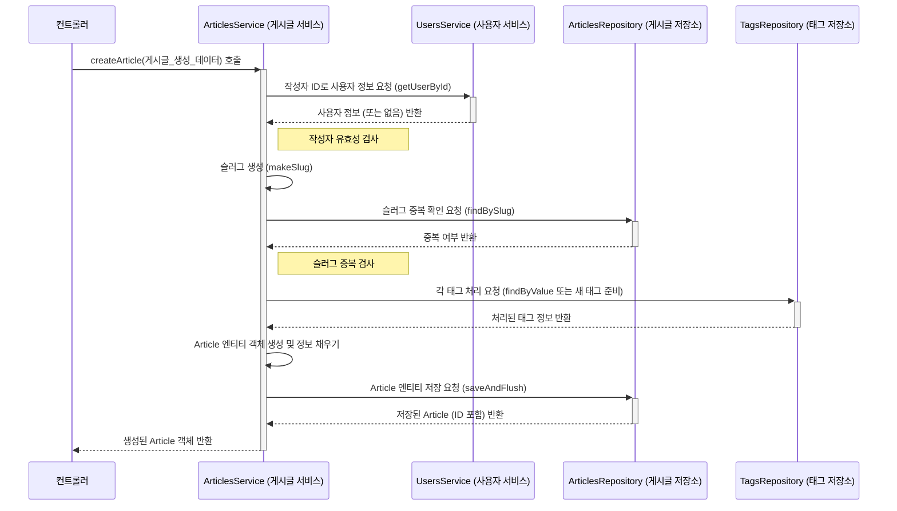

# Chapter 5: 백엔드 핵심 서비스 로직


안녕하세요! 지난 [제4장: 백엔드 API 엔드포인트 (컨트롤러)](04_백엔드_api_엔드포인트__컨트롤러__.md)에서는 프론트엔드의 요청을 받는 백엔드의 "문" 역할인 컨트롤러에 대해 배웠습니다. 컨트롤러는 마치 식당의 웨이터처럼 주문(요청)을 받고, 이 주문을 실제 요리를 하는 "주방"으로 전달한다고 했죠.

이번 장에서는 바로 그 "주방" 안에서 실제로 어떤 일들이 벌어지는지, 즉 애플리케이션의 핵심적인 작업들이 처리되는 **백엔드 핵심 서비스 로직**에 대해 알아보겠습니다. 이 서비스 로직은 우리 애플리케이션의 '두뇌'와도 같습니다.

## 왜 핵심 서비스 로직이 필요할까요?

사용자가 새 블로그 글을 작성한다고 상상해 보세요.
1.  **프론트엔드**: 사용자는 글 제목, 설명, 본문, 태그 등을 입력하고 "발행" 버튼을 누릅니다.
2.  **백엔드 API 엔드포인트 (컨트롤러)**: [제4장: 백엔드 API 엔드포인트 (컨트롤러)](04_백엔드_api_엔드포인트__컨트롤러__.md)에서 배운 컨트롤러가 이 요청을 받습니다. 예를 들어, `/articles` URL로 POST 요청이 들어오겠죠.

하지만 컨트롤러가 모든 일을 다 할까요? 글 내용을 데이터베이스에 저장하고, 태그를 분석하고, URL에 사용될 고유한 슬러그(slug)를 만들고... 이런 복잡한 작업들을 컨트롤러가 직접 다 처리한다면 컨트롤러 코드가 너무 길고 복잡해질 거예요.

그래서 컨트롤러는 "요청을 받고 응답을 보내는" 역할에 집중하고, 실제 **핵심적인 비즈니스 처리**는 "서비스 계층(Service Layer)"이라는 전문가에게 맡깁니다. 마치 회사의 부서와 같아요. 고객 응대 데스크(컨트롤러)는 고객의 요청을 접수하고, 실제 업무는 각 전문 부서(서비스)에서 처리하는 거죠. 예를 들어 "게시글 관리부", "사용자 관리부"처럼요.

이 서비스 계층이 바로 백엔드 핵심 서비스 로직을 담당하는 부분입니다.

## 백엔드 핵심 서비스 로직이란 무엇인가요?

**백엔드 핵심 서비스 로직**은 애플리케이션의 주요 기능을 실제로 수행하는 백엔드의 '두뇌'와 같습니다. 예를 들어, 새 글을 작성하거나, 사용자를 팔로우하는 등의 복잡한 요청이 들어왔을 때, 다음과 같은 일들을 처리합니다:

*   **비즈니스 규칙 적용**: "게시글 제목은 비어 있을 수 없다", "사용자 이름은 중복될 수 없다" 와 같은 애플리케이션 고유의 규칙을 적용합니다.
*   **데이터 처리 및 검증**: 요청받은 데이터를 확인하고, 필요한 형태로 가공하며, 더 상세한 유효성 검사를 수행합니다.
*   **데이터 영속성 관리**: 처리된 데이터를 데이터베이스에 저장하거나, 필요한 데이터를 데이터베이스에서 불러오는 작업을 [제6장: 백엔드 데이터 모델 및 영속성](06_백엔드_데이터_모델_및_영속성_.md)에서 다룰 데이터 접근 계층(Repository)에 지시합니다.
*   **다른 서비스와의 협력**: 때로는 하나의 기능을 처리하기 위해 여러 서비스가 함께 작업해야 할 수도 있습니다. (예: 게시글 작성 시 사용자 정보 확인을 위해 사용자 서비스 호출)

우리 프로젝트에서 서비스 로직은 주로 `apps/backend/src/main/java/com/marcusmonteirodesouza/realworld/api/.../services` 폴더 안에 있는 Java 클래스들로 구현됩니다. 각 서비스 클래스는 특정 도메인(예: 게시글, 사용자, 프로필)과 관련된 핵심 기능들을 메서드 형태로 제공합니다.

## 핵심 서비스 로직 살펴보기: 새 게시글 작성 예시 (`ArticlesService`)

새로운 게시글을 작성하는 기능을 예로 들어, `ArticlesService`가 어떻게 동작하는지 살펴보겠습니다. 관련 코드는 `apps/backend/src/main/java/com/marcusmonteirodesouza/realworld/api/articles/services/ArticlesService.java` 파일에 있습니다.

컨트롤러가 프론트엔드로부터 게시글 생성 요청을 받으면, 다음과 같은 정보를 담은 `ArticleCreate` 객체를 `ArticlesService`의 `createArticle` 메서드로 전달합니다.

```java
// 파일: apps/backend/src/main/java/.../parameterobjects/ArticleCreate.java (간략화)
// 이 객체는 서비스 메서드에 전달되는 '요청 명세서'와 같습니다.
public class ArticleCreate {
    private final String authorId; // 작성자 ID
    private final String title;    // 제목
    private final String description; // 설명
    private final String body;     // 본문
    private final Optional<Collection<String>> tagList; // 태그 목록 (선택 사항)

    // 생성자 (실제로는 더 복잡할 수 있음)
    public ArticleCreate(String authorId, String title, String description, String body, Optional<Collection<String>> tagList) {
        this.authorId = authorId;
        this.title = title;
        // ... 나머지 필드 초기화 ...
        this.tagList = tagList;
    }

    // 각 필드 값을 가져오는 메서드들 (getters)
    public String getAuthorId() { return authorId; }
    public String getTitle() { return title; }
    // ... 등등 ...
}
```
이 `ArticleCreate` 객체는 컨트롤러가 HTTP 요청으로부터 받은 데이터를 서비스가 이해하기 쉬운 형태로 포장한 것입니다.

이제 `ArticlesService`의 `createArticle` 메서드가 이 `ArticleCreate` 객체를 받아 어떤 일들을 하는지 단계별로 살펴봅시다.

```java
// 파일: apps/backend/src/main/java/.../services/ArticlesService.java (createArticle 메서드 일부)
@Service // 이 클래스가 서비스 계층의 핵심 로직을 담당함을 Spring에게 알립니다.
public class ArticlesService {
    // ArticlesService가 사용하는 다른 서비스나 저장소(Repository)들
    private final UsersService usersService; // 사용자 관련 처리를 위한 서비스
    private final ArticlesRepository articlesRepository; // 게시글 데이터 저장을 위한 저장소
    private final TagsRepository tagsRepository; // 태그 데이터 저장을 위한 저장소
    // ... 기타 필요한 구성 요소들 ...

    // 생성자: 필요한 서비스와 저장소들을 주입받습니다.
    public ArticlesService(
            UsersService usersService,
            ArticlesRepository articlesRepository,
            TagsRepository tagsRepository,
            /* ... */) {
        this.usersService = usersService;
        this.articlesRepository = articlesRepository;
        this.tagsRepository = tagsRepository;
        // ...
    }

    public Article createArticle(ArticleCreate articleCreate) throws AlreadyExistsException {
        // 1. 요청 정보 로깅 (개발 및 문제 해결에 유용)
        logger.info("게시글 생성 시도: " + articleCreate.getTitle());

        // 2. 작성자(author) 정보 확인
        var author = usersService.getUserById(articleCreate.getAuthorId()).orElse(null);
        if (author == null) {
            throw new NotFoundException("작성자 '" + articleCreate.getAuthorId() + "'를 찾을 수 없습니다.");
        }

        // 3. 게시글 제목으로 고유한 슬러그(slug) 생성
        // 예: "How To Train Your Dragon" -> "how-to-train-your-dragon"
        var slug = makeSlug(articleCreate.getTitle());

        // 4. 이미 같은 슬러그의 게시글이 있는지 확인 (중복 방지)
        if (getArticleBySlug(slug).isPresent()) {
            throw new AlreadyExistsException("슬러그 '" + slug + "'를 사용하는 게시글이 이미 존재합니다.");
        }

        // 5. 태그 처리 (새 태그는 만들고, 기존 태그는 가져오기)
        var tagList = new HashSet<Tag>();
        if (articleCreate.getTagList().isPresent()) {
            for (String tagValue : articleCreate.getTagList().get()) {
                tagList.add(makeTag(tagValue)); // makeTag는 내부적으로 태그를 찾거나 생성
            }
        }

        // 6. 새 Article 객체(데이터베이스에 저장될 게시글 정보) 생성
        var article = new Article();
        article.setAuthorId(author.getId());
        article.setSlug(slug);
        article.setTitle(articleCreate.getTitle());
        article.setDescription(articleCreate.getDescription());
        article.setBody(articleCreate.getBody());
        article.setTagList(tagList);

        // 7. 완성된 Article 객체를 데이터베이스에 저장 (ArticlesRepository 사용)
        return articlesRepository.saveAndFlush(article); // 저장된 Article 객체 반환
    }

    // 슬러그를 만드는 내부 헬퍼 메서드 (간략화)
    private String makeSlug(String title) {
        // Slugify 라이브러리를 사용하여 title을 URL 친화적인 문자열로 변환
        // 예: "My New Post!" -> "my-new-post"
        return new Slugify().slugify(title);
    }

    // 태그를 처리하는 내부 헬퍼 메서드 (간략화)
    private Tag makeTag(String tagValue) {
        // tagValue를 소문자로 변환하고 공백 제거 등 정규화
        String normalizedTag = tagValue.toLowerCase().trim();
        // TagsRepository를 사용해 이미 존재하는 태그인지 확인
        Optional<Tag> existingTag = tagsRepository.findByValue(normalizedTag);
        if (existingTag.isPresent()) {
            return existingTag.get(); // 존재하면 기존 태그 반환
        } else {
            return new Tag(normalizedTag); // 없으면 새 Tag 객체 생성하여 반환 (저장은 Article 저장 시 함께 됨)
        }
    }
    // ... 다른 게시글 관련 서비스 메서드들 ...
}
```

위 코드에서 `createArticle` 메서드가 하는 일을 순서대로 보면 다음과 같습니다:

1.  **로깅**: 어떤 요청이 들어왔는지 기록합니다.
2.  **작성자 확인**: `UsersService`를 호출하여 게시글 작성자 ID가 유효한지, 해당 사용자가 실제로 존재하는지 확인합니다. 만약 사용자가 없다면 `NotFoundException` 오류를 발생시켜 컨트롤러에게 알립니다. (다른 서비스와의 협력!)
3.  **슬러그 생성**: `makeSlug`라는 내부 메서드를 호출하여 게시글 제목으로부터 URL 친화적인 고유 식별자(슬러그)를 만듭니다. 이것이 게시글의 고유 주소가 됩니다. (비즈니스 규칙 적용!)
4.  **슬러그 중복 확인**: 생성된 슬러그가 이미 다른 게시글에서 사용 중인지 `articlesRepository`를 통해 확인합니다. 중복된다면 `AlreadyExistsException` 오류를 발생시킵니다. (데이터 일관성 및 비즈니스 규칙!)
5.  **태그 처리**: `makeTag` 내부 메서드를 통해 요청에 포함된 각 태그를 처리합니다. 기존에 있는 태그면 그것을 사용하고, 새로운 태그면 새로 만듭니다. (데이터 가공 및 생성!)
6.  **Article 엔티티 생성**: 모든 정보가 준비되면, 데이터베이스에 저장될 실제 게시글 데이터인 `Article` 객체를 만들고, 앞에서 준비한 작성자 ID, 슬러그, 제목, 내용, 태그 목록 등을 설정합니다. ([제6장: 백엔드 데이터 모델 및 영속성](06_백엔드_데이터_모델_및_영속성_.md)에서 이 `Article` 객체에 대해 더 자세히 배웁니다.)
7.  **데이터베이스 저장**: `articlesRepository.saveAndFlush(article)`를 호출하여 `Article` 객체를 데이터베이스에 저장합니다. 저장소(Repository)는 실제 데이터베이스와의 통신을 담당합니다. 저장에 성공하면, 데이터베이스에 저장된 `Article` 객체(보통 ID가 자동 생성되어 포함됨)를 반환합니다. 이 반환된 객체는 다시 컨트롤러를 통해 프론트엔드로 전달됩니다.

이렇게 `ArticlesService`는 단순히 데이터를 받아서 저장하는 것 이상으로, 여러 비즈니스 규칙을 적용하고, 필요한 데이터를 가공하며, 다른 서비스(`UsersService`)나 데이터 접근 계층(`ArticlesRepository`, `TagsRepository`)과 협력하여 하나의 완전한 기능을 수행합니다.

## 핵심 서비스 로직의 내부 동작 흐름

서비스 로직이 컨트롤러로부터 요청을 받아 처리하고 결과를 돌려주는 과정을 좀 더 시각적으로 이해해 봅시다. 새 게시글 작성 시나리오를 예로 든 순서도입니다.



이처럼 서비스 로직은 마치 잘 짜인 연극의 감독처럼, 필요한 배우(다른 서비스, 저장소)들을 적시에 등장시키고, 정해진 시나리오(비즈니스 규칙)에 따라 극(기능)을 완성해 나갑니다.

## 또 다른 예시: 사용자 팔로우/언팔로우 (`ProfilesService`)

다른 서비스의 예로, `ProfilesService` (경로: `apps/backend/src/main/java/com/marcusmonteirodesouza/realworld/api/profiles/services/ProfilesService.java`)는 사용자 프로필 조회, 팔로우, 언팔로우 기능을 담당합니다. 예를 들어 `followUser` 메서드는 다음과 같은 로직을 수행할 수 있습니다 (간략화된 개념):

```java
// 파일: .../services/ProfilesService.java (followUser 메서드 개념)
public class ProfilesService {
    private final UsersService usersService;
    private final FollowsRepository followsRepository; // 팔로우 관계 저장을 위한 저장소

    // ... 생성자 ...

    public void followUser(String followerId, String followedId) {
        // 1. 이미 팔로우하고 있는지 확인 (followsRepository 사용)
        if (isFollowing(followerId, followedId)) {
            return; // 이미 팔로우 중이면 아무것도 안 함
        }

        // 2. 팔로우하는 사용자(follower)와 팔로우 받는 사용자(followed)가 실제 존재하는지 확인
        // (UsersService 사용)
        var follower = usersService.getUserById(followerId).orElseThrow(() -> new NotFoundException("팔로워를 찾을 수 없습니다."));
        var followed = usersService.getUserById(followedId).orElseThrow(() -> new NotFoundException("팔로우할 사용자를 찾을 수 없습니다."));

        // 3. Follow 관계 생성 및 저장
        var follow = new Follow();
        follow.setFollowerId(follower.getId());
        follow.setFollowedId(followed.getId());
        followsRepository.save(follow); // 팔로우 관계를 데이터베이스에 저장
    }

    private Boolean isFollowing(String followerId, String followedId) {
        // followsRepository를 통해 두 사용자 간의 팔로우 관계가 이미 존재하는지 확인
        return followsRepository.existsByFollowerIdAndFollowedId(followerId, followedId);
    }
    // ... 언팔로우, 프로필 조회 등의 다른 메서드들 ...
}
```
여기서도 `ProfilesService`는 `UsersService`와 `FollowsRepository`와 협력하여 "사용자 팔로우"라는 비즈니스 기능을 완성합니다.

## 서비스 로직의 주요 역할

지금까지 살펴본 것처럼 백엔드 핵심 서비스 로직은 다음과 같은 중요한 역할을 합니다:

*   **비즈니스 로직의 중심**: 애플리케이션의 핵심 규칙과 절차를 구현합니다.
*   **데이터 처리**: 입력 데이터를 검증하고, 필요한 형태로 가공합니다.
*   **트랜잭션 관리**: 여러 데이터 변경 작업을 하나의 단위로 묶어 처리하여 데이터의 일관성을 보장합니다. (예: Spring의 `@Transactional` 어노테이션을 사용하여, 게시글 저장과 태그 저장이 모두 성공하거나 모두 실패하도록 관리)
*   **다른 계층과의 조정**: 컨트롤러로부터 요청을 받고, 데이터 접근 계층(Repository)에 데이터 CRUD(생성, 읽기, 수정, 삭제)를 지시하며, 때로는 다른 서비스와 협력합니다.

서비스 계층을 잘 설계하면 다음과 같은 장점이 있습니다:
*   **관심사 분리**: 컨트롤러는 HTTP 요청/응답 처리에, 서비스는 비즈니스 로직에, 저장소는 데이터베이스 접근에 집중할 수 있어 코드가 명확해집니다.
*   **재사용성 향상**: 여러 컨트롤러나 다른 서비스에서 공통된 비즈니스 로직을 쉽게 재사용할 수 있습니다.
*   **테스트 용이성**: 비즈니스 로직 부분을 독립적으로 테스트하기 쉬워집니다.
*   **유지보수 용이성**: 변경 사항이 생겼을 때 관련된 비즈니스 로직만 수정하면 되므로 유지보수가 쉬워집니다.

## 정리하며

이번 장에서는 `serverless-realworld-monorepo` 프로젝트 백엔드의 '두뇌' 역할을 하는 **핵심 서비스 로직**에 대해 배웠습니다.

*   서비스 로직은 애플리케이션의 **주요 기능과 비즈니스 규칙을 실제로 구현**하는 부분입니다.
*   컨트롤러로부터 요청을 받아 데이터를 처리하고, 필요한 경우 다른 서비스나 데이터 접근 계층(Repository)과 **협력**합니다.
*   Java Spring Boot에서는 `@Service` 어노테이션을 붙인 클래스로 서비스 로직을 구현하며, 이들은 **비즈니스 규칙 적용, 데이터 가공, 트랜잭션 관리** 등의 중요한 책임을 가집니다.
*   `ArticlesService`의 `createArticle` 예시를 통해 서비스가 어떻게 데이터를 검증하고, 슬러그를 만들고, 태그를 처리하며, 최종적으로 게시글을 저장하는지 살펴보았습니다.

이제 컨트롤러가 요청을 어떻게 받고 서비스에게 전달하는지, 그리고 서비스가 그 요청을 어떻게 핵심적으로 처리하는지 알게 되었습니다. 그렇다면 이 서비스들은 데이터를 실제로 어디에, 어떻게 저장하고 불러오는 걸까요? 그 비밀은 바로 데이터베이스와 소통하는 "데이터 모델 및 영속성" 계층에 있습니다.

다음 장에서는 서비스 로직이 사용하는 데이터의 구조(모델)는 어떻게 정의되고, 이 데이터들이 데이터베이스에 어떻게 저장되고 관리되는지(영속성) 자세히 알아보겠습니다.

➡️ [제6장: 백엔드 데이터 모델 및 영속성](06_백엔드_데이터_모델_및_영속성_.md)

---

Generated by [AI Codebase Knowledge Builder](https://github.com/The-Pocket/Tutorial-Codebase-Knowledge)