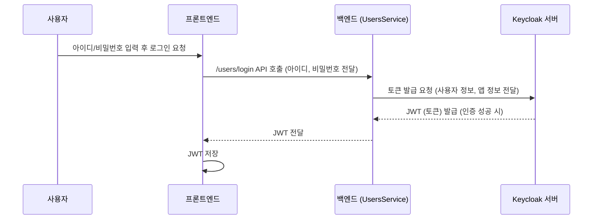
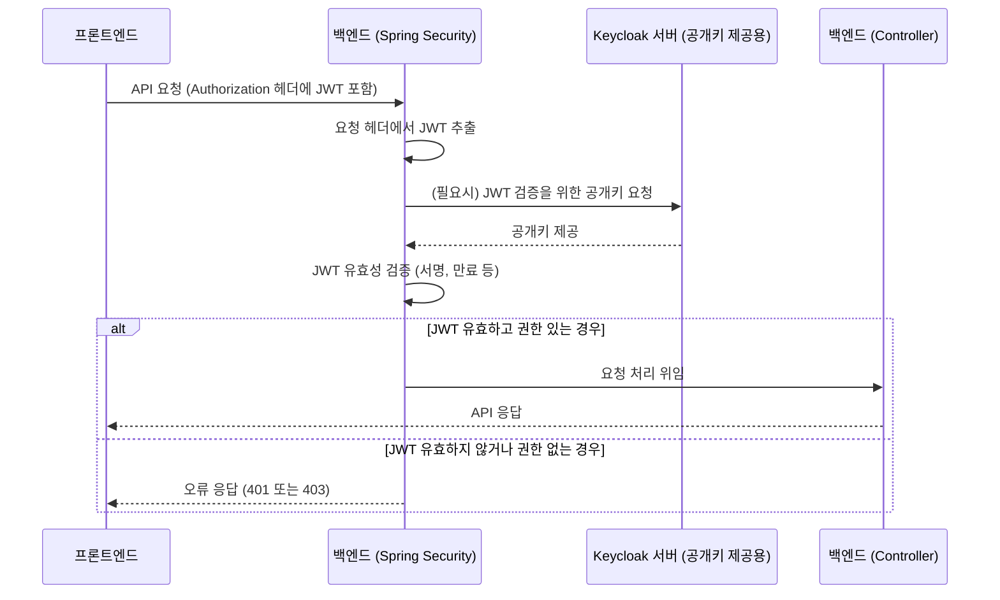

# Chapter 7: 백엔드 인증 및 보안


안녕하세요! 지난 [제6장: 백엔드 데이터 모델 및 영속성](06_백엔드_데이터_모델_및_영속성_.md)에서는 우리 애플리케이션의 데이터를 어떻게 구조화하고(데이터 모델), 데이터베이스에 안전하게 저장하고 불러오는지(영속성)에 대해 알아보았습니다. 잘 정리된 데이터는 소중하지만, 아무나 이 데이터에 접근하거나 함부로 수정하게 둘 수는 없겠죠?

이번 장에서는 우리 애플리케이션의 문지기, 바로 **백엔드 인증 및 보안**에 대해 이야기해 보겠습니다. 사용자가 누구인지 확인하고(인증), 허가된 작업만 수행하도록 통제하여(인가) 우리 시스템을 안전하게 지키는 방법을 배울 거예요.

## 왜 인증과 보안이 중요할까요?

여러분이 블로그에 글을 쓴다고 생각해 보세요. 글을 쓰거나 수정하는 것은 글쓴이 본인만 할 수 있어야 합니다. 아무나 다른 사람의 글을 마음대로 바꾸거나 삭제할 수 있다면 큰일이겠죠? 또한, 어떤 기능은 관리자만 사용할 수 있도록 제한해야 할 수도 있습니다.

*   **인증 (Authentication)**: "당신은 누구신가요?" – 시스템을 사용하려는 사람이 정말로 자신이 주장하는 그 사람이 맞는지 확인하는 과정입니다. 마치 건물에 들어갈 때 신분증을 보여주는 것과 같아요.
*   **인가 (Authorization)**: "당신은 이 일을 할 수 있나요?" – 인증된 사용자가 특정 작업이나 정보에 접근할 권한이 있는지 검사하는 과정입니다. 신분증을 확인하고 건물에 들어왔더라도, 특정 사무실에 들어가려면 그에 맞는 출입증이 또 필요한 것과 비슷합니다.

우리 `serverless-realworld-monorepo` 프로젝트에서는 이러한 인증과 인가 기능을 구현하여 애플리케이션을 안전하게 보호합니다. 이 중요한 임무를 위해 **Keycloak**과 **Spring Security**라는 두 가지 강력한 도구를 사용합니다.

## 우리 시스템의 보안 담당자: Keycloak과 Spring Security

애플리케이션의 보안을 책임지는 두 명의 전문가를 소개합니다.

1.  **Keycloak (키클록)**:
    *   **역할**: 독립적인 신원 및 접근 관리 시스템입니다. 사용자 계정 정보(아이디, 비밀번호 등)를 중앙에서 관리하고, 로그인 요청 시 사용자를 인증하며, 성공 시 "인증서"(토큰)를 발급해줍니다.
    *   **비유**: 큰 건물의 중앙 출입 관리 시스템과 같습니다. 모든 방문객의 신원을 확인하고, 출입증(토큰)을 발급하는 역할을 합니다.
    *   우리 프로젝트에서는 `apps/backend/docker-compose.yaml` 파일에 Keycloak 서비스가 정의되어 별도의 서버로 실행됩니다. Keycloak 설정에 대한 자세한 내용은 `apps/backend/docs/set-up-keycloak/README.md` 문서에서 확인할 수 있습니다.

2.  **Spring Security (스프링 시큐리티)**:
    *   **역할**: Spring Boot로 만들어진 우리 백엔드 애플리케이션 내부의 보안을 담당하는 프레임워크입니다. Keycloak이 발급한 출입증(토큰)이 유효한지 검사하고, 이 출입증을 가진 사용자가 요청한 작업을 수행할 권한이 있는지 확인합니다.
    *   **비유**: 건물의 각 층이나 특정 구역을 지키는 경비원과 같습니다. 중앙에서 발급받은 출입증을 보고, 해당 구역에 들어갈 수 있는 사람인지, 특정 행동을 해도 되는지 등을 판단합니다.

Keycloak이 "당신은 누구인가?" (인증)를 주로 담당한다면, Spring Security는 "당신은 무엇을 할 수 있는가?" (인가)와 함께 인증된 토큰의 유효성을 검증하는 역할을 합니다.

## 인증 과정: "당신은 누구신가요?" (로그인)

사용자가 우리 웹사이트에 로그인하려고 할 때 어떤 일이 일어나는지 살펴봅시다.

1.  **프론트엔드**: 사용자가 로그인 페이지에서 아이디(이메일)와 비밀번호를 입력하고 "로그인" 버튼을 클릭합니다.
2.  **백엔드 API 호출**: 프론트엔드는 이 정보를 백엔드의 `/users/login` API 엔드포인트([제4장: 백엔드 API 엔드포인트 (컨트롤러)](04_백엔드_api_엔드포인트__컨트롤러__.md)에서 배움)로 보냅니다.
3.  **`UsersService`의 `getToken` 메서드**: `UsersController`는 `UsersService`([제5장: 백엔드 핵심 서비스 로직](05_백엔드_핵심_서비스_로직_.md)에서 배움)에 있는 `getToken` 메서드를 호출합니다. 이 메서드가 Keycloak과 직접 통신합니다.

다음은 `UsersService.java`의 `getToken` 메서드 일부입니다.
```java
// 파일: apps/backend/src/main/java/.../UsersService.java (일부)
public String getToken(String username, String password) {
    // Keycloak 서버 정보, realm, 클라이언트 ID/Secret 등으로 Keycloak 인스턴스 생성
    var keycloakInstance =
            Keycloak.getInstance(
                    keycloakServerUrl, // 예: "http://keycloak:8080"
                    keycloakRealm,     // 예: "realworld"
                    username,          // 사용자가 입력한 아이디
                    password,          // 사용자가 입력한 비밀번호
                    keycloakClientId,  // 우리 앱을 Keycloak에 등록할 때 받은 ID
                    keycloakClientSecret); // 우리 앱의 비밀키

    try {
        // Keycloak에 "이 사용자로 토큰을 발급해주세요!" 요청
        return keycloakInstance.tokenManager().grantToken().getToken();
    } finally {
        keycloakInstance.close(); // 사용 후 연결 종료
    }
}
```
*   `Keycloak.getInstance(...)`: 사용자가 입력한 아이디, 비밀번호와 우리 애플리케이션이 Keycloak에 등록될 때 받은 고유 식별자(`keycloakClientId`, `keycloakClientSecret`)를 사용하여 Keycloak 서버에 연결합니다.
*   `keycloakInstance.tokenManager().grantToken().getToken()`: Keycloak 서버에 인증을 요청하고, 성공하면 JWT(JSON Web Token)라는 특별한 형태의 토큰을 받습니다. 이 토큰은 암호화된 사용자 정보와 유효 기간 등을 담고 있는 "디지털 신분증"과 같습니다.

4.  **토큰 전달 및 저장**: `UsersService`는 이 JWT 토큰을 컨트롤러를 통해 프론트엔드로 전달합니다. 프론트엔드는 이 토큰을 안전한 곳(예: 브라우저의 로컬 스토리지 또는 `iron-session`을 통해 쿠키에)에 저장해 둡니다. ([제2장: 프론트엔드 사용자 액션 및 세션 관리](02_프론트엔드_사용자_액션_및_세션_관리_.md) 참고)

로그인(인증) 흐름을 간단히 그림으로 보면 다음과 같습니다.


이제 사용자는 "디지털 신분증"(JWT)을 발급받았습니다!

## 인가 과정: "이 작업을 할 수 있나요?" (보호된 API 접근)

사용자가 로그인 후, 예를 들어 새 게시글을 작성하려고 합니다. 게시글 작성은 인증된 사용자만 할 수 있는 기능이므로, 시스템은 이 사용자가 정말로 권한이 있는지 확인해야 합니다.

1.  **프론트엔드**: 새 게시글 작성 API(`POST /articles`)를 호출할 때, 이전에 저장해둔 JWT를 HTTP 요청의 `Authorization` 헤더에 담아 보냅니다. 형식은 보통 `Authorization: Token <JWT 값>` 입니다.
2.  **Spring Security 필터**: 백엔드 애플리케이션은 모든 요청을 받으면 가장 먼저 Spring Security의 보안 필터들을 통과시킵니다.
3.  **토큰 검증**: `apps/backend/src/main/java/com/marcusmonteirodesouza/realworld/api/security/SecurityConfig.java` 파일에 정의된 설정에 따라 Spring Security는 다음 작업들을 수행합니다.
    *   **토큰 추출**: `Authorization` 헤더에서 "Token " 부분을 제외한 순수 JWT 값을 꺼냅니다.
    ```java
    // 파일: SecurityConfig.java (토큰 추출 부분)
    // ...
    .bearerTokenResolver(
            httpServletRequest -> {
                var header = httpServletRequest.getHeader(HttpHeaders.AUTHORIZATION);
                if (header == null || header.isBlank() || !header.startsWith("Token ")) {
                    return null; // 토큰이 없거나 형식이 다르면 null 반환
                }
                return header.split("Token ")[1].trim(); // "Token " 다음의 실제 토큰 값 추출
            })
    // ...
    ```
    *   **JWT 유효성 검사**: 추출된 JWT가 정말 Keycloak에서 발급한 것이 맞는지, 위변조되지 않았는지, 만료되지 않았는지 등을 Keycloak의 공개키를 사용하여 검증합니다. 이 공개키 정보는 Keycloak 서버의 특정 주소(보통 `issuer-uri`로 설정)를 통해 얻습니다.
    ```java
    // 파일: SecurityConfig.java (JWT 검증 설정)
    // ...
    .oauth2ResourceServer(
            oauth2ResourceServerCustomizer ->
                    oauth2ResourceServerCustomizer
                            .jwt(Customizer.withDefaults())) // 기본 JWT 처리 방식 사용
    // ...
    ```
    Spring Boot는 `application.properties`나 환경변수에 설정된 `spring.security.oauth2.resourceserver.jwt.issuer-uri` 값을 보고 Keycloak 서버로부터 필요한 정보(공개키 등)를 가져와 JWT를 검증합니다.

4.  **사용자 정보 로드**: 토큰 검증에 성공하면, Spring Security는 토큰에 담긴 사용자 정보(예: 사용자 ID, 역할)를 읽어 `Authentication` 객체를 만들고, 이를 `SecurityContextHolder`라는 특별한 저장소에 보관합니다. 이제 시스템은 "현재 요청을 보낸 사용자는 OOO이다"라고 알게 됩니다.

5.  **접근 권한 확인**: `SecurityConfig.java`에는 어떤 URL 경로에 어떤 권한이 필요한지 정의되어 있습니다.
    ```java
    // 파일: SecurityConfig.java (경로별 접근 권한 설정 부분)
    // ...
    .authorizeHttpRequests(
            authorizeHttpRequests ->
                    authorizeHttpRequests
                            // POST /users (회원가입), POST /users/login (로그인) 은 누구나 접근 가능
                            .requestMatchers(HttpMethod.POST, "/users").permitAll()
                            .requestMatchers(HttpMethod.POST, "/users/login").permitAll()
                            // GET /articles, GET /articles/* (특정 글 조회) 등도 누구나 접근 가능
                            .requestMatchers(HttpMethod.GET, "/articles").permitAll()
                            .requestMatchers(HttpMethod.GET, "/articles/*").permitAll()
                            // 그 외 나머지 모든 요청은 인증(로그인)된 사용자만 접근 가능
                            .anyRequest().authenticated())
    // ...
    ```
    *   `.requestMatchers(HttpMethod.POST, "/users").permitAll()`: `/users` 경로로 오는 POST 요청(회원가입)은 누구나 허용합니다.
    *   `.anyRequest().authenticated()`: 그 외 명시되지 않은 다른 모든 요청은 반드시 인증(로그인)된 사용자만 접근할 수 있도록 합니다.
    *   만약 특정 역할(예: 관리자)만 접근 가능하게 하려면 `.hasRole("ADMIN")` 또는 `.hasAuthority("ROLE_ADMIN")` 같은 규칙을 추가할 수 있습니다.

6.  **결과**:
    *   **권한 있음**: 사용자가 요청한 작업에 대한 권한이 있으면, 요청은 다음 단계인 컨트롤러로 전달되어 실제 로직이 실행됩니다.
    *   **권한 없음**: 권한이 없으면 Spring Security는 401 Unauthorized (인증 필요) 또는 403 Forbidden (인증은 되었으나 권한 없음) 오류를 프론트엔드로 응답합니다.

보호된 API 접근(인가) 흐름을 간단히 그림으로 보면 다음과 같습니다.


## 현재 로그인한 사용자는 누구? (`IAuthenticationFacade`)

컨트롤러나 서비스 로직에서 현재 요청을 보낸 사용자가 누구인지 알아야 할 때가 있습니다. 예를 들어, "내 정보 수정" 기능은 현재 로그인한 바로 그 사용자의 정보를 수정해야 하겠죠.

Spring Security는 인증된 사용자 정보를 `SecurityContextHolder`에 저장한다고 했습니다. 이 정보에 쉽게 접근할 수 있도록 우리 프로젝트에는 `IAuthenticationFacade` 와 그 구현체인 `AuthenticationFacade`가 있습니다.

```java
// 파일: apps/backend/src/main/java/.../authentication/IAuthenticationFacade.java
package com.marcusmonteirodesouza.realworld.api.authentication;

import org.springframework.security.core.Authentication;

public interface IAuthenticationFacade {
    Authentication getAuthentication(); // 현재 인증 정보를 가져오는 메서드
}
```

```java
// 파일: apps/backend/src/main/java/.../authentication/AuthenticationFacade.java
package com.marcusmonteirodesouza.realworld.api.authentication;

import org.springframework.security.core.Authentication;
import org.springframework.security.core.context.SecurityContextHolder;
import org.springframework.stereotype.Component;

@Component // Spring이 이 클래스를 관리하도록 함
public class AuthenticationFacade implements IAuthenticationFacade {
    @Override
    public Authentication getAuthentication() {
        // SecurityContextHolder에서 현재 스레드의 Authentication 객체를 가져옴
        return SecurityContextHolder.getContext().getAuthentication();
    }
}
```
컨트롤러나 서비스에서 이 `AuthenticationFacade`를 주입받아 사용하면, `authenticationFacade.getAuthentication().getName()`과 같이 현재 사용자의 ID(Keycloak의 경우 보통 사용자 ID 또는 username)를 얻을 수 있습니다.

예를 들어, `ArticlesController`에서 새 글을 작성할 때 작성자 ID를 현재 로그인한 사용자 ID로 설정하는 코드를 볼 수 있습니다.
```java
// ArticlesController.java의 createArticle 메서드 (일부)
// ...
// IAuthenticationFacade authenticationFacade; (생성자를 통해 주입받음)
// ...
public ArticleResponse createArticle(@RequestBody CreateArticleRequest request) {
    // 현재 인증된 사용자 정보 가져오기. getName()은 보통 사용자 ID (sub 클레임)
    var userId = authenticationFacade.getAuthentication().getName();

    var article = articlesService.createArticle(
        new ArticleCreate(
            userId, // 현재 로그인한 사용자 ID를 작성자로 사용
            request.article.title,
            // ...
        )
    );
    // ...
}
```

## Keycloak 사용자 관리 (`UsersService` 심층 분석)

`UsersService`는 단순히 `getToken`만 하는 것이 아니라, Keycloak에 사용자를 생성하거나 정보를 조회/수정하는 역할도 합니다. 이를 위해 Keycloak Admin Client라는 라이브러리를 사용합니다.

```java
// 파일: apps/backend/src/main/java/.../UsersService.java (일부)
@Service
public class UsersService {
    private Keycloak keycloakAdminInstance; // Keycloak 관리 작업을 위한 인스턴스

    // Keycloak 서버 URL, 관리자 계정 정보 등은 환경 변수(@Value)를 통해 주입받음
    @Value("${keycloak.admin-password}") private String keycloakAdminPassword;
    // ... 기타 @Value 필드들 ...

    @PostConstruct // UsersService가 생성된 후 자동으로 호출되는 메서드
    public void initKeycloak() {
        // 관리자 권한으로 Keycloak 서버에 연결하는 인스턴스 생성
        keycloakAdminInstance =
                KeycloakBuilder.builder()
                        .serverUrl(keycloakServerUrl)
                        .realm(keycloakRealm) // "master" realm이 아닌 우리 앱 realm
                        .clientId(keycloakClientId) // admin-cli 또는 별도 관리용 클라이언트
                        .clientSecret(keycloakClientSecret)
                        .grantType(OAuth2Constants.PASSWORD) // 관리자 아이디/비번으로 인증
                        .username(keycloakAdminUsername)
                        .password(keycloakAdminPassword)
                        .build();
    }

    public User createUser(String username, String email, String password)
            throws AlreadyExistsException {
        // ... username, email 유효성 및 중복 검사 ...

        var usersResource = keycloakAdminInstance.realm(keycloakRealm).users();
        var userRepresentation = new UserRepresentation(); // Keycloak에 전달할 사용자 정보
        userRepresentation.setUsername(username);
        userRepresentation.setEmail(email);
        userRepresentation.setEnabled(true); // 사용자 활성화

        // Keycloak에 사용자 생성 요청
        var createUserResponse = usersResource.create(userRepresentation);
        var userId = CreatedResponseUtil.getCreatedId(createUserResponse); // 생성된 사용자 ID

        // 생성된 사용자의 비밀번호 설정
        var passwordCredential = makePasswordCredentialRepresentation(password);
        usersResource.get(userId).resetPassword(passwordCredential);

        return new User(userRepresentation); // 우리 애플리케이션의 User 모델로 변환하여 반환
    }
    // ... getUserById, getUserByEmail, updateUser 등 다른 메서드들 ...
}
```
*   `initKeycloak()`: `UsersService`가 시작될 때, 백엔드 애플리케이션의 관리자 계정 정보를 사용하여 Keycloak 서버에 연결합니다. 이 `keycloakAdminInstance`는 사용자 목록 조회, 사용자 생성/수정/삭제 등의 관리 작업을 수행하는 데 사용됩니다. (`docker-compose.yaml`에서 `KEYCLOAK_REALM_ADMIN` 등의 환경 변수로 관리자 정보가 설정됩니다.)
*   `createUser()`:
    1.  새 사용자의 정보를 담은 `UserRepresentation` 객체를 만듭니다.
    2.  `keycloakAdminInstance`를 통해 Keycloak 서버에 이 사용자를 생성하도록 요청합니다.
    3.  생성된 사용자의 비밀번호를 설정합니다. Keycloak은 사용자와 비밀번호를 별도로 관리합니다.
    4.  결과를 우리 애플리케이션의 `User` 모델로 변환하여 반환합니다.

이처럼 `UsersService`는 Keycloak과 긴밀하게 연동하여 사용자 계정 관리를 통합적으로 처리합니다.

## Keycloak 설정 한눈에 보기

Keycloak을 우리 프로젝트에서 사용하기 위한 핵심 설정들은 다음과 같습니다:

*   **`apps/backend/docker-compose.yaml`**:
    *   `keycloak` 서비스: Keycloak 서버 자체를 실행합니다.
    *   `keycloakdb` 서비스: Keycloak이 자신의 설정 및 사용자 데이터를 저장할 데이터베이스(PostgreSQL)입니다.
    *   `app` 서비스 (우리 백엔드 애플리케이션)의 환경 변수들:
        *   `KEYCLOAK_SERVER_URL`: Keycloak 서버 주소.
        *   `KEYCLOAK_REALM`: 우리 애플리케이션이 사용할 Keycloak 영역(realm) 이름.
        *   `KEYCLOAK_REALM_CLIENT_ID`, `KEYCLOAK_REALM_CLIENT_SECRET`: 우리 백엔드 앱이 Keycloak 클라이언트로서 가지는 ID와 비밀키.
        *   `KEYCLOAK_REALM_ADMIN`, `KEYCLOAK_REALM_ADMIN_PASSWORD`: `UsersService`가 Keycloak Admin Client를 사용할 때 필요한 관리자 계정 정보.

*   **`apps/backend/docs/set-up-keycloak/README.md`**:
    *   Keycloak 서버 실행 후, 관리자 콘솔에 접속하여 Realm, Client, 사용자 속성, 그룹, 관리자 사용자 등을 수동으로 설정하는 방법을 안내합니다. 이 설정이 백엔드 애플리케이션의 환경 변수와 일치해야 합니다.

*   **`apps/backend/src/main/resources/application.properties` (또는 환경 변수)**:
    *   `spring.security.oauth2.resourceserver.jwt.issuer-uri=${KEYCLOAK_SERVER_URL}/realms/${KEYCLOAK_REALM}`: Spring Security가 JWT를 검증할 때 필요한 Keycloak realm의 issuer URI를 지정합니다. Spring Security는 이 주소를 통해 JWT 서명 검증에 필요한 공개키 등을 자동으로 가져옵니다.

이 설정들이 올바르게 갖춰져야 백엔드 애플리케이션이 Keycloak과 원활하게 통신하며 인증/인가 기능을 수행할 수 있습니다.

## 정리하며

이번 장에서는 우리 `serverless-realworld-monorepo` 프로젝트의 백엔드 시스템이 어떻게 사용자를 확인하고(인증), 특정 작업에 대한 권한을 검사하는지(인가)에 대해 알아보았습니다.

*   **인증(Authentication)**은 사용자가 누구인지 확인하는 과정이며, 주로 **Keycloak**이 담당합니다. 사용자가 로그인하면 Keycloak은 JWT라는 디지털 신분증을 발급합니다.
*   **인가(Authorization)**는 인증된 사용자가 특정 작업을 수행할 권한이 있는지 검사하는 과정이며, **Spring Security**가 담당합니다. Spring Security는 프론트엔드가 보내온 JWT를 검증하고, 설정된 규칙에 따라 접근을 허용하거나 차단합니다.
*   `UsersService`는 Keycloak과 통신하여 사용자 계정을 관리하고 토큰을 발급받는 역할을 합니다.
*   `SecurityConfig.java` 파일에서 어떤 API 경로가 인증을 필요로 하는지, 어떤 토큰 처리 방식을 사용할지 등을 설정합니다.
*   `IAuthenticationFacade`를 통해 현재 로그인한 사용자 정보를 쉽게 가져올 수 있습니다.

마치 건물의 출입 관리 시스템(Keycloak)과 내부 경비원(Spring Security)이 협력하여 건물의 안전을 지키듯, 이 두 시스템은 우리 애플리케이션의 데이터를 안전하게 보호하고 허가된 사용자만이 적절한 작업을 수행하도록 보장합니다.

이것으로 `serverless-realworld-monorepo` 프로젝트의 백엔드 핵심 구성 요소들에 대한 여정을 마무리합니다. [공유 데이터 타입](01_공유_데이터_타입_.md)에서 시작하여, [API 엔드포인트(컨트롤러)](04_백엔드_api_엔드포인트__컨트롤러__.md), [핵심 서비스 로직](05_백엔드_핵심_서비스_로직_.md), [데이터 모델 및 영속성](06_백엔드_데이터_모델_및_영속성_.md), 그리고 이번 장의 [인증 및 보안](07_백엔드_인증_및_보안_.md)까지, 백엔드가 어떻게 요청을 받고, 처리하고, 데이터를 저장하며, 보안을 유지하는지 살펴보았습니다.

프론트엔드 튜토리얼 ([제2장: 프론트엔드 사용자 액션 및 세션 관리](02_프론트엔드_사용자_액션_및_세션_관리_.md), [제3장: 프론트엔드 API 라우트](03_프론트엔드_api_라우트_.md))과 함께 이 백엔드 지식을 통합하면 전체 애플리케이션의 동작 방식을 더 깊이 이해하실 수 있을 것입니다. 이 튜토리얼이 여러분의 학습에 도움이 되었기를 바랍니다!

---

Generated by [AI Codebase Knowledge Builder](https://github.com/The-Pocket/Tutorial-Codebase-Knowledge)