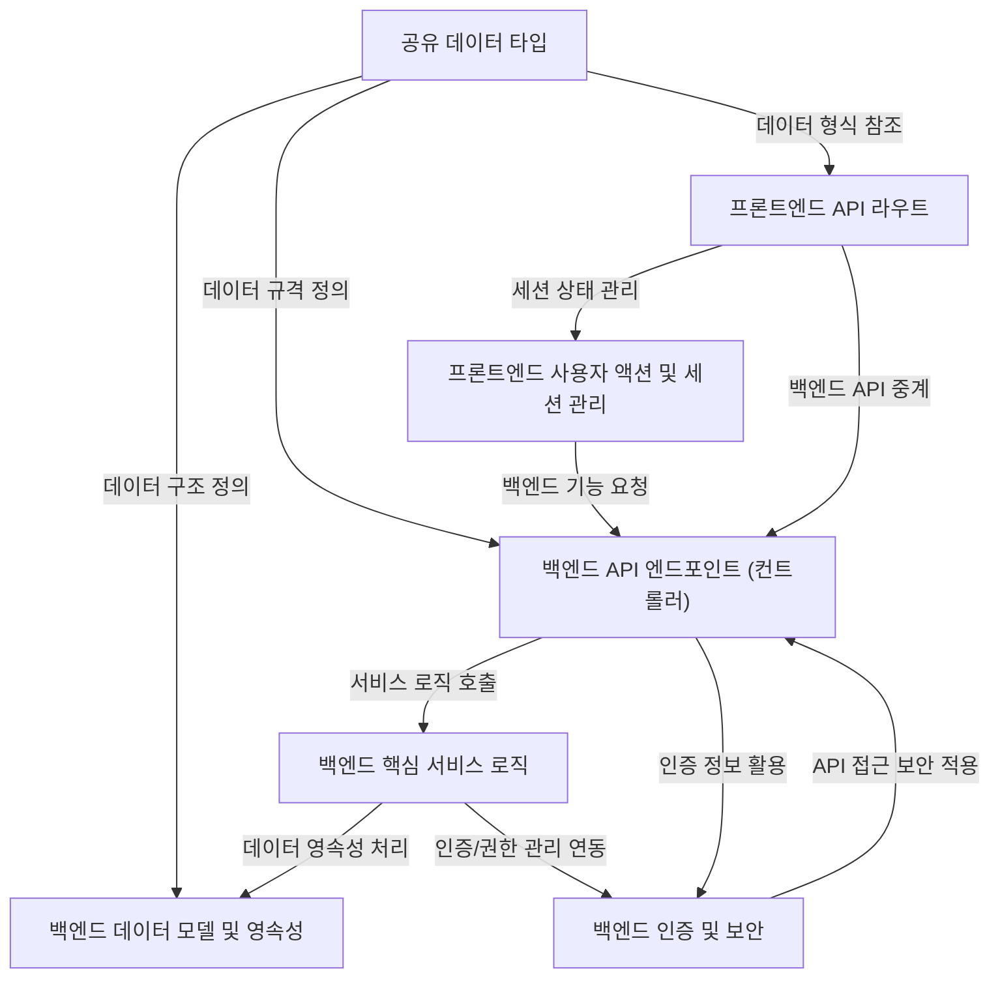

# Tutorial: serverless-realworld-monorepo

이 프로젝트는 **"RealWorld"** 예제 애플리케이션으로, 블로그와 유사한 *풀스택 플랫폼*입니다.
사용자는 *회원가입*, *로그인* 후 *게시글을 작성하고 읽을 수 있으며*, *댓글을 달거나 다른 사용자를 팔로우*하고, 자신의 *프로필을 관리*할 수 있습니다.
**Next.js** 프론트엔드와 **Spring Boot** 백엔드로 구성되어 있으며, **Keycloak**을 사용해 인증을 처리합니다.
프론트엔드와 백엔드 간의 데이터는 *미리 정의된 공유 데이터 타입*을 통해 일관성 있게 주고받습니다.

**Source Repository:** [None](None)

## Chapters

1. [공유 데이터 타입
](01_공유_데이터_타입_.md)
2. [프론트엔드 사용자 액션 및 세션 관리
](02_프론트엔드_사용자_액션_및_세션_관리_.md)
3. [프론트엔드 API 라우트
](03_프론트엔드_api_라우트_.md)
4. [백엔드 API 엔드포인트 (컨트롤러)
](04_백엔드_api_엔드포인트__컨트롤러__.md)
5. [백엔드 핵심 서비스 로직
](05_백엔드_핵심_서비스_로직_.md)
6. [백엔드 데이터 모델 및 영속성
](06_백엔드_데이터_모델_및_영속성_.md)
7. [백엔드 인증 및 보안
](07_백엔드_인증_및_보안_.md)

---

Generated by [AI Codebase Knowledge Builder](https://github.com/The-Pocket/Tutorial-Codebase-Knowledge)