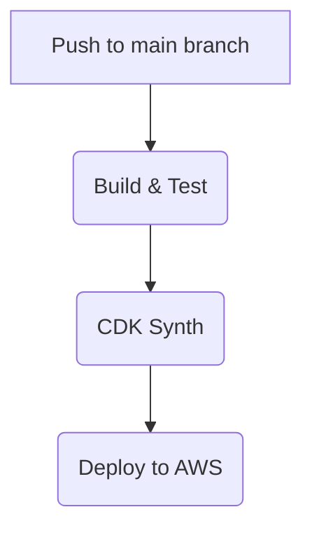

# IaC와 CI/CD 전략

## AWS CDK를 활용한 인프라 구성

1. 각 마이크로서비스(Lambda, API Gateway, DynamoDB, Cognito 등)를 스택 단위로 정의
2. 스테이지(개발, 스테이징, 프로덕션)별로 파라미터를 분리하여 재사용성 확보
3. `cdk synth`를 통해 CloudFormation 템플릿을 생성하고 `cdk deploy`로 배포

## GitHub Actions를 이용한 파이프라인

1. PR 또는 main 브랜치로의 푸시 시 Maven 빌드 및 단위 테스트 실행
2. CDK 애플리케이션을 빌드하여 CloudFormation 템플릿 생성
3. 필요 시 승인 단계를 거쳐 `cdk deploy` 명령으로 각 스택 배포

Secrets 관리에는 GitHub Actions의 암호화된 변수와 AWS IAM 역할을 활용합니다.

